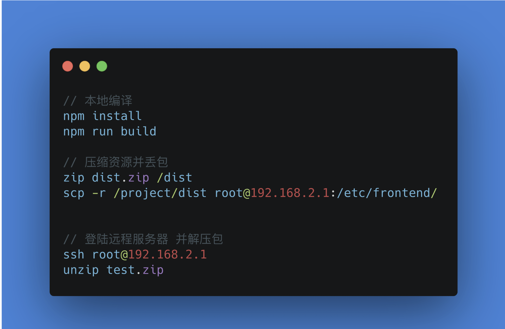
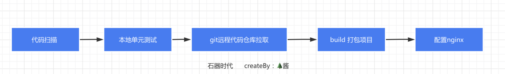
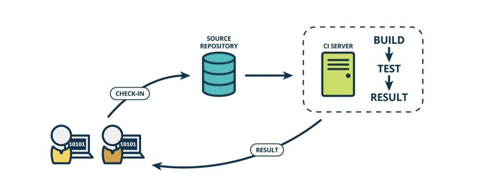
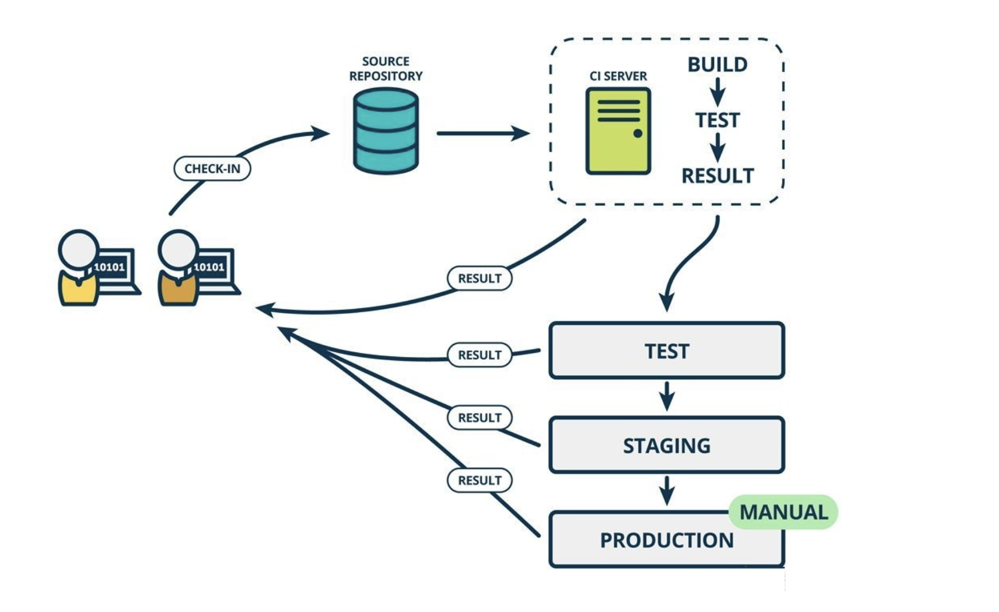

## 1.远古时代
> 我们知道，对于一般的SPA应用，本质是静态资源（后端渲染SSR忽略），执行build命令，把项目打包build一下完，压缩打包之后的文件，ssh连接服务器并把压缩好的文件“丢”到服务器，解压上传的文件，最后配置下Nginx即可访问到该项目的资源，石器时代我们是这样走流程的，流程如下

我们大概需要完成以下操作

 * 本地执行 **npm run build** 构建项目，压缩编译好的资源文件
 * 将压缩包丢到远程服务器
 * ssh到远程服务器，解压压缩包
 * 配置nginx

## 2.铁器时代
> 到后来前端有了自己的工具链，为了让发布前对代码健壮性和功能完整性有个验证，在发布流程中加入了单元测试和代码扫描，验证完之后再通过服务器手动拉取最新代码（git）再build编译项目，最后配置下Nginx即可访问到该项目的资源，铁器时代我们是这样走流程的，流程如下

完成一个完整的前端项目发布闭环，我们大概需要完成以下操作

 * 代码扫描 npm run lint 检查代码是否规范（eslint）
 * 本地跑单元测试 npm run unit 检查单元测试结果
 * 用git将测试完的代码提交到远程仓库如gitlab
 * 登录远程测试服务器，拉取代码，执行 npm run build 构建项目
 * 如果是后端渲染项目（SSR）如果是基于pm2做进程管理的还需要重启 pm2 restart

每次发布都需要手动“丢包”，不断重复机械化的工作，可想而知效率会有多慢，而且更难保证每次每个步骤都不会疏忽，可能忘记做单元测试就进行了代码提交，造成程序出错等

## 3.CICD时代
> CICD是什么？ 顾名思义就是持续集成(Continuous Integration)和持续交付(Continuous Delivery),简单理解就是把我们之前需要手动去执行的部署构建环节自动化，一步到位，解放双手

* 持续集成：当代码仓库代码发生变更，就会自动对代码进行测试和构建，反馈运行结果。
在传统的软件开发中，整合过程通常在每个人完成工作之后、在项目结束阶段进行。整合过程通常需要数周乃至数月的时间，可能会非常痛苦。持续集成是一种在开发周期的早期阶段进行集成的实践，以便构建、测试、整合代码可以更经常的进行。

CI意味着一个在家里的笔记本上写代码的开发者（比如Steve）和另外一位在办公室桌上写代码的开发人员（比如Annie）可以分别为同一款产品编写软件，将他们的修改合并在一个称为源代码库的地方。然后他们可以从各自编写并合并在一起的代码中构建软件，并测试它是否按照他们期望的方式工作。

开发人员通常使用称为CI服务器的工具来为其构建和集成。CI要求Steve和Annie有能自我测试的代码。这些代码测试自身确保它们能按预期运行。通常这些测试被称为单元测试。在整合代码后，当所有的单元测试通过，Steve和Annie会获得绿色构建版本。这表明他们已经验证他们的更改成功的整合在了一起，并且代码正如测试所预期的那样工作。

不过，尽管集成的代码能成功的工作，但仍然不能投产，因为它还没有在类似生产环境中测试和验证以表明能够工作。

为了实践CI，Steve和Annie必须提交代码到主要的源代码仓库，密集、经常的集成和测试他们的代码。通常每小时多次，但是每天至少一次。

CI的优点在于，整合代码变成了“非事件”（译注：意思是它总在发生，出错也不奇怪）。软件一直在编写和集成。在搞CI以前，代码集成发生在创建过程结束之后，所有整合一次性完成，然后花费的时间未知。现在有了CI，代码集成每天都在发生，只需要花费几分钟的时间。它仅是我们的工作方式。

你的团队很有可能正在搞CI（或者至少他们相信自己正在捣鼓）。你可以通过询问他们是否每天都整合代码来进行确认。CI是进行持续交付所需的第一种实践。事实上，如果你曾经签入过帮助文本、文档或图片，那么你可能已经在一直在不断的集成。

* 持续交付：持续交付是在持续集成的基础上，可以将集成后的代码依次部署到测试环境、予发布环境、生产环境等中

让我们回到两位开发者Steve和Annie身上。持续交付意味着每次Steve或Annie对代码进行更改、集成和构建时，他们也会在与生产环境非常相似的状态下进行自动的代码测试。我们称这一系列的“部署-测试”到不同环境的操作为部署流水线。通常来说，部署流水线有一个开发环境，一个测试环境，还有一个准生产环境，但是这些阶段因团队，产品和组织各异。例如，我们的Mingle团队有一个称为“蛋糕”的准生产环境，而Etsy的准生产环境叫做“公主”。（译注：消除开发环境和生产环境差异，参考Docker技术体系）

在每个不同的环境中，Annie或Steve写的代码被分别测试。这给了他们越来越多的信心。对你而言，就是代码被部署到生产环境中时，它能够工作。至关重要的是，代码只有在部署流水线中通过了前面的测试，才能提升到下一个测试环境。这样，Annie和Steve可以从每个环境的测试中获得新的反馈。如果出现了错误，他们可以更容易的理解问题到底在哪里，并且在代码进入生产环境之前修复它们。

### 参考
[前端工程化之CICD那点破事](https://juejin.cn/post/6870325047324573710#heading-2)