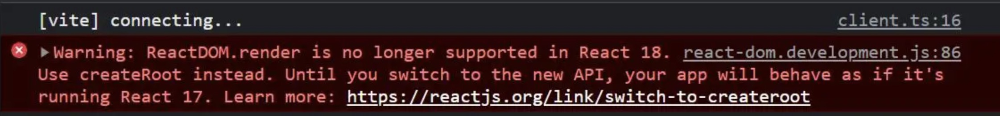

> 在 2021 年 6 月份，React 18 Working Group（React 18 工作组，简称 reactwg）成立了，并且公布了 v18 版本的发布计划，经过将近一年的迭代和准备，在 2022 年 3 月 29 日，React 18 正式版终于发布了。
可以在官网看到，**react 17** 的发布时间是 2020 年 10 月 20 号，距离 React 18 发布足足间隔一年半，并且v17中只有三个小版本，分别是**17.0.0、17.0.1、17.0.2：**

* 17.0.0 - React 17 正式版发布
* 17.0.1 - 只改动了 1 个文件，修复 ie 兼容问题，同时提升了 V8 内部对数组的执行性能
* 17.0.2 - 改动集中于 Scheduler 包, 主干逻辑没有变动，只与性能统计相关

可以看到，在 React 17 的两次迭代中，都是只更新了补丁号，并且都是一些比较细节的更新，直到一年半之后的今天 React 18 正式版发布，React 17 都没有任何更新，所以 React 17 也被称为 垫脚石版本， 可以看出，React 工作组 对新特性的探索相当谨慎。
今天，就从开发者的角度来探索下 React 18 的一些新特性。

### 注意

React 18 已经放弃了对 **ie11** 的支持，将于 **2022年6月15日** 停止支持 **ie**，如需兼容，需要回退到 React 17 版本。

```
React 18 中引入的新特性是使用现代浏览器的特性构建的，在IE中无法充分polyfill，比如micro-tasks
```

## 新特性
### 一、 Render API
为了更好的管理**root节点**，**React 18** 引入了一个新的 **root API**，新的 **root API** 还支持 **new concurrent renderer**（并发模式的渲染），它允许你进入**concurrent mode**（并发模式）。

```tsx
// React 17
import React from 'react';
import ReactDOM from 'react-dom';
import App from './App';

const root = document.getElementById('root')!;

ReactDOM.render(<App />, root);

// React 18
import React from 'react';
import ReactDOM from 'react-dom/client';
import App from './App';

const root = document.getElementById('root')!;

ReactDOM.createRoot(root).render(<App />);
```

同时，在卸载组件时，我们也需要将 **unmountComponentAtNode** 升级为 **root.unmount**:
```
// React 17
ReactDOM.unmountComponentAtNode(root);

// React 18
root.unmount();
```

tips：我们如果在 **React 18** 中使用旧的 **render api**，在项目启动后，你将会在控制台中看到一个警告：



这表示你可以将项目直接升级到 **React 18** 版本，而不会直接造成 **break change**。如果你需要保持着 **React 17** 版本的特性的话，那么你可以无视这个报错，因为它在整个 18 版本中都是兼容的。

在新版本中，如果需要在 **render** 方法中使用回调函数，我们可以在组件中通过 **useEffect** 实现：
```tsx
// React 17
const root = document.getElementById('root')!;
ReactDOM.render(<App />, root, () => {
  console.log('渲染完成');
});

// React 18
const AppWithCallback: React.FC = () => {
  useEffect(() => {
    console.log('渲染完成');
  }, []);
  return <App />;
};
const root = document.getElementById('root')!;
ReactDOM.createRoot(root).render(<AppWithCallback />);
```

最后，如果你的项目使用了**ssr**服务端渲染，需要把**hydration**升级为**hydrateRoot**：
```ts
// React 17
import ReactDOM from 'react-dom';
const root = document.getElementById('root');
ReactDOM.hydrate(<App />, root);

// React 18
import ReactDOM from 'react-dom/client';
const root = document.getElementById('root')!;
ReactDOM.hydrateRoot(root, <App />);
```

另外，还需要更新 **TypeScript** 类型定义，如果你的项目使用了 **TypeScript**，最值得注意的变化是，现在在定义**props**类型时，如果需要获取子组件**children**，那么你需要**显式的定义它**，例如这样：

```ts
// React 17
interface MyButtonProps {
  color: string;
}

const MyButton: React.FC<MyButtonProps> = ({ children }) => {
  // 在 React 17 的 FC 中，默认携带了 children 属性
  return <div>{children}</div>;
};

export default MyButton;

// React 18
interface MyButtonProps {
  color: string;
  children?: React.ReactNode;
}

const MyButton: React.FC<MyButtonProps> = ({ children }) => {
  // 在 React 18 的 FC 中，不存在 children 属性，需要手动申明
  return <div>{children}</div>;
};

export default MyButton;

```

### 二、 setState 自动批处理
**React 18** 通过在默认情况下执行批处理来实现了开箱即用的性能改进。

批处理是指为了获得更好的性能，在数据层，将**多个状态更新批量处理**，合并成**一次更新**（在视图层，将**多个渲染**合并成**一次渲染**）。

#### 1. 在 React 18 之前：
在**React 18 之前**，我们只在 **React 事件处理函数** 中进行批处理更新。默认情况下，在**promise、setTimeout、原生事件处理函数**中、或**任何其它事件内的更新**都不会进行批处理：

#### 情况一：React 事件处理函数

```tsx
import React, { useState } from 'react';

// React 18 之前
const App: React.FC = () => {
  console.log('App组件渲染了！');
  const [count1, setCount1] = useState(0);
  const [count2, setCount2] = useState(0);
  return (
    <button
      onClick={() => {
        setCount1(count => count + 1);
        setCount2(count => count + 1);
        // 在React事件中被批处理
      }}
    >
      {`count1 is ${count1}, count2 is ${count2}`}
    </button>
  );
};

export default App;

```

点击button，打印console.log：
结果渲染次数和更新次数是**一样**的，即使我们更新了两个状态，每次更新组件也**只渲染一次**。

但是，如果我们把状态的更新放在**promise**或者**setTimeout**里面：

#### 情况二：setTimeout
```tsx
import React, { useState } from 'react';

// React 18 之前
const App: React.FC = () => {
  console.log('App组件渲染了！');
  const [count1, setCount1] = useState(0);
  const [count2, setCount2] = useState(0);
  return (
    <div
      onClick={() => {
        setTimeout(() => {
          setCount1(count => count + 1);
          setCount2(count => count + 1);
        });
        // 在 setTimeout 中不会进行批处理
      }}
    >
      <div>count1： {count1}</div>
      <div>count2： {count2}</div>
    </div>
  );
};

export default App;
```

点击button，重新打印console.log：
结果每次点击更新两个状态，组件都会渲染两次，不会进行批量更新。

#### 情况三：原生js事件

```tsx
import React, { useEffect, useState } from 'react';

// React 18 之前
const App: React.FC = () => {
  console.log('App组件渲染了！');
  const [count1, setCount1] = useState(0);
  const [count2, setCount2] = useState(0);
  useEffect(() => {
    document.body.addEventListener('click', () => {
      setCount1(count => count + 1);
      setCount2(count => count + 1);
    });
    // 在原生js事件中不会进行批处理
  }, []);
  return (
    <>
      <div>count1： {count1}</div>
      <div>count2： {count2}</div>
    </>
  );
};

export default App;
```

点击button，重新打印console.log：
在原生js事件中，结果跟情况二是一样的，每次点击更新两个状态，组件都会渲染两次，不会进行批量更新。

#### 2. 在 React 18 中：

在 **React 18** 上面的三个例子只会有一次 **render**，因为所有的更新都将自动批处理。这样无疑是很好的提高了应用的整体性能。
不过以下例子会在 React 18 中**执行两次** render：

```tsx
import React, { useState } from 'react';

// React 18
const App: React.FC = () => {
  console.log('App组件渲染了！');
  const [count1, setCount1] = useState(0);
  const [count2, setCount2] = useState(0);
  return (
    <div
      onClick={async () => {
        await setCount1(count => count + 1);
        setCount2(count => count + 1);
      }}
    >
      <div>count1： {count1}</div>
      <div>count2： {count2}</div>
    </div>
  );
};

export default App;

```

**总结：**
* 在 18 之前，只有在react事件处理函数中，才会自动执行批处理，其它情况会多次更新
* 在 18 之后，任何情况都会自动执行批处理，多次更新始终合并为一次

### 三、flushSync

批处理是一个 **破坏性改动**，如果你想退出批量更新，你可以使用 **flushSync：**

```tsx
import React, { useState } from 'react';
import { flushSync } from 'react-dom';

const App: React.FC = () => {
  const [count1, setCount1] = useState(0);
  const [count2, setCount2] = useState(0);
  return (
    <div
      onClick={() => {
        flushSync(() => {
          setCount1(count => count + 1);
        });
        // 第一次更新
        flushSync(() => {
          setCount2(count => count + 1);
        });
        // 第二次更新
      }}
    >
      <div>count1： {count1}</div>
      <div>count2： {count2}</div>
    </div>
  );
};

export default App;
```

注意：**flushSync** 函数内部的多个 **setState** **仍然为批量更新**，这样可以精准控制哪些不需要的批量更新。
有关**批处理**和**flushSync**的更多信息，你可以参阅 **React** 官方的[Automatic batching deep dive（批处理深度分析）](https://github.com/reactwg/react-18/discussions/21)。

### 四、关于 React 组件的返回值

* 在 **React 17** 中，如果你需要返回一个空组件，React只允许返回**null**。如果你显式的返回了 **undefined**，控制台则会在运行时抛出一个错误。
* 在 **React 18** 中，不再检查因返回 **undefined** 而导致崩溃。既能返回 null，也能返回 undefined（但是 **React 18** 的dts文件还是会检查，只允许返回 null，你可以忽略这个类型错误）。

#### 五、Strict Mode
不再抑制控制台日志：

当你使用**严格模式**时，React 会对每个组件进行**两次渲染**，以便你观察一些意想不到的结果。在 **React 17** 中，取消了**其中一次**渲染的控制台日志，以便让日志更容易阅读。

为了解决社区对这个问题的困惑，在 **React 18** 中，官方取消了这个限制。如果你安装了**React DevTools**，第二次渲染的日志信息将显示为灰色，以柔和的方式显式在控制台。

#### 六、Suspense 不再需要 fallback 来捕获
在 **React 18** 的 **Suspense** 组件中，官方对 **空的fallback** 属性的处理方式做了改变：不再跳过 **缺失值** 或 **值为null** 的 **fallback** 的 **Suspense** 边界。相反，会捕获边界并且向外层查找，如果查找不到，将会把 **fallback** 呈现为 **null**。

**更新前：**

以前，如果你的 **Suspense** 组件没有提供 **fallback** 属性，React 就会悄悄跳过它，继续向上搜索下一个边界：

```tsx
// React 17
const App = () => {
  return (
    <Suspense fallback={<Loading />}> // <--- 这个边界被使用，显示 Loading 组件
      <Suspense>                      // <--- 这个边界被跳过，没有 fallback 属性
        <Page />
      </Suspense>
    </Suspense>
  );
};

export default App;

```

React 工作组发现这可能会导致混乱、难以调试的情况发生。例如，你正在debug一个问题，并且在没有 **fallback** 属性的 **Suspense** 组件中抛出一个边界来测试一个问题，它可能会带来一些意想不到的结果，并且 **不会警告** 说它 **没有fallback** 属性。

**更新后：**
现在，React将使用当前组件的 **Suspense** 作为边界，即使当前组件的 **Suspense** 的值为 **null** 或 **undefined：**

```tsx
// React 18
const App = () => {
  return (
    <Suspense fallback={<Loading />}> // <--- 不使用
      <Suspense>                      // <--- 这个边界被使用，将 fallback 渲染为 null
        <Page />
      </Suspense>
    </Suspense>
  );
};

export default App;
```

这个更新意味着我们**不再跨越边界组件**。相反，我们将在边界处捕获并呈现 **fallback**，就像你提供了一个返回值为 **null** 的组件一样。这意味着被挂起的 **Suspense** 组件将按照预期结果去执行，如果忘记提供 **fallback** 属性，也不会有什么问题。

关于 Suspense 的官方解释： [github.com/reactwg/rea…](https://github.com/reactwg/react-18/discussions/72)

参考资料：

1. [React18 新特性解读 & 完整版升级指南](https://juejin.cn/post/7094037148088664078#heading-30)
2. [React v18.0](https://react.docschina.org/blog/2022/03/29/react-v18.html)