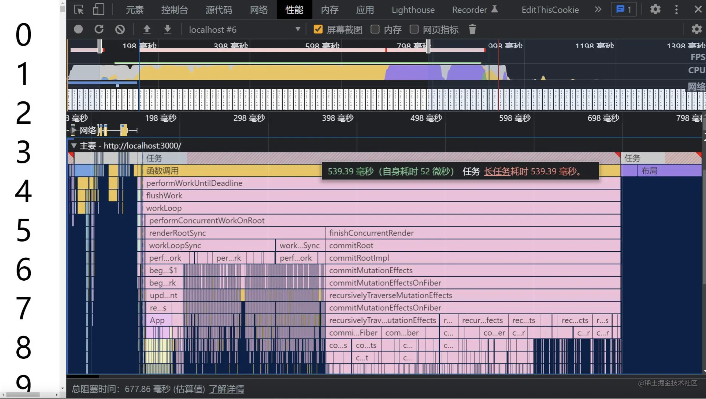

> 本章书接上文**React18 新特性解读(一)**

## 新的API
### 一、useId
```tsx
const id = useId();
```
支持同一个组件在客户端和服务端生成相同的唯一的 **ID**，避免 **hydration** 的不兼容，这解决了在 **React 17 及 17** 以下版本中已经存在的问题。因为我们的服务器渲染时提供的 HTML 是无序的，**useId** 的原理就是每个 **id** 代表该组件在组件树中的层级结构。
有关useId的更多信息，请参阅 [useId post in the working group](https://github.com/reactwg/react-18/discussions/111)。

### 二、useSyncExternalStore
**useSyncExternalStore** 是一个新的api，经历了一次修改，由 **useMutableSource** 改变而来，主要用来解决外部数据撕裂问题。

**useSyncExternalStore** 能够通过强制同步更新数据让 **React** 组件在 **CM** 下安全地有效地读取外接数据源。 在 **Concurrent Mode** 下，React 一次渲染会分片执行（以 fiber 为单位），中间可能穿插优先级更高的更新。假如在高优先级的更新中改变了公共数据（比如 **redux** 中的数据），那之前低优先的渲染必须要重新开始执行，否则就会出现前后状态不一致的情况。

**useSyncExternalStore** 一般是三方状态管理库使用，我们在日常业务中不需要关注。因为 **React** 自身的 **useState** 已经原生的解决的并发特性下的 **tear（撕裂）**问题。
**useSyncExternalStore** 主要对于框架开发者，比如 **redux**，它在控制状态时可能并非直接使用的 **React** 的 **state**，而是自己在外部维护了一个 **store** 对象，用发布订阅模式实现了数据更新，脱离了 **React** 的管理，也就无法依靠 **React** 自动解决撕裂问题。因此 **React** 对外提供了这样一个 API。

目前 **React-Redux 8.0** 已经基于 **useSyncExternalStore** 实现。

### 三、useInsertionEffect
```tsx
const useCSS = rule => {
  useInsertionEffect(() => {
    if (!isInserted.has(rule)) {
      isInserted.add(rule);
      document.head.appendChild(getStyleForRule(rule));
    }
  });
  return rule;
};

const App: React.FC = () => {
  const className = useCSS(rule);
  return <div className={className} />;
};

export default App;
```

这个 **Hooks** 只建议 **css-in-js** 库来使用。 这个 **Hooks** 执行时机在 **DOM** 生成之后，**useLayoutEffect** 之前，它的工作原理大致和**useLayoutEffect** 相同，只是此时无法访问 **DOM** 节点的引用，一般用于提前注入 style 脚本。

### Concurrent Mode（并发模式）

**Concurrent Mode**（以下简称 **CM**）翻译叫并发模式，这个概念我们或许已经听过很多次了，实际上，在去年这个概念已经很成熟了，在 **React 17** 中就可以通过一些试验性的api开启 CM。

```
CM 本身并不是一个功能，而是一个底层设计
```

并发模式可帮助应用保持响应，并根据用户的设备性能和网速进行适当的调整，该模式通过使渲染可中断来修复 **阻塞渲染** 限制。在 **Concurrent** 模式中，**React** 可以同时更新多个状态。

说的太复杂可能有点拗口，总结一句话就是：

**React 17** 和 **React 18** 的区别就是：从 **同步不可中断更新** 变成了 **异步可中断更新**。

**重点来了，阅读下面的部分请勿跳过：**
我们在文章开始提到过：在 **React 18** 中，提供了新的 **root api**，我们只需要把 **render** 升级成 **createRoot(root).render(<App />)** 就可以开启并发模式了。

那么这个时候，可能有同学会提问：开启并发模式就是开启了并发更新么？

**NO！** 在 **React 17** 中一些实验性功能里面，开启并发模式就是开启了并发更新，但是在 React 18 正式版发布后，由于官方策略调整，**React** 不再依赖并发模式开启并发更新了。

换句话说：开启了**并发模式**，并不一定开启了**并发更新**！

一句话总结：在 18 中，不再有多种模式，而是以**是否使用并发特性**作为是否**开启并发更新**的依据。

从最老的版本到当前的**v18**，市面上有多少个版本的**React**？

可以从架构角度来概括下，当前一共有两种架构：

* 采用不可中断的 **递归** 方式更新的**Stack Reconciler**（老架构）
* 采用可中断的 **遍历** 方式更新的**Fiber Reconciler**（新架构）

新架构可以选择是否开启 **并发更新**，所以当前市面上所有 **React** 版本有四种情况：

1. 老架构（v15及之前版本）
2. 新架构，未开启并发更新，与情况1行为一致（v16、v17 默认属于这种情况）
3. 新架构，未开启并发更新，但是启用了并发模式和一些新功能（比如 **Automatic Batching**，v18 默认属于这种情况）
4. 新架构，开启并发模式，开启并发更新

**并发特性**指开启**并发模式**后才能使用的特性，比如：

* **useDeferredValue**
* **useTransition**

关系图：


了解清楚他们的关系之后，我们可以继续探索 **并发更新** 了：

### 并发特性；
### 一、startTransition
在v18中运行如下代码：
```tsx
import React, { useState, useEffect, useTransition } from 'react';

const App: React.FC = () => {
  const [list, setList] = useState<any[]>([]);
  const [isPending, startTransition] = useTransition();
  useEffect(() => {
    // 使用了并发特性，开启并发更新
    startTransition(() => {
      setList(new Array(10000).fill(null));
    });
  }, []);
  return (
    <>
      {list.map((_, i) => (
        <div key={i}>{i}</div>
      ))}
    </>
  );
};

export default App;

```
由于 **setList** 在 **startTransition** 的回调函数中执行（使用了**并发特性**），所以 **setList** 会触发**并发更新**。

**startTransition**，主要为了能在大量的任务下也能保持 **UI** 响应。这个新的 **API** 可以通过将特定更新标记为“过渡”来显著改善用户交互，简单来说，就是被 **startTransition** 回调包裹的 setState 触发的渲染被标记为**不紧急渲染**，这些渲染可能被其他紧急渲染所抢占。

有关startTransition的更多信息，请参阅 [Patterns for startTransition](https://github.com/reactwg/react-18/discussions/100)。

### 二、useDeferredValue

返回一个延迟响应的值，可以让一个 **state** 延迟生效，只有当前没有紧急更新时，该值才会变为**最新值**。**useDeferredValue** 和 **startTransition** 一样，都是标记了一次非紧急更新。
从介绍上来看 **useDeferredValue** 与 **useTransition** 是否感觉很相似呢？

相同：**useDeferredValue** 本质上和内部实现与 **useTransition** 一样，都是标记成了**延迟更新任务**。
不同：**useTransition** 是把更新任务变成了延迟更新任务，而 **useDeferredValue** 是产生一个新的值，这个值作为延时状态。（**一个用来包装方法，一个用来包装值**）

所以，上面 startTransition 的例子，我们也可以用 useDeferredValue 来实现：

```tsx
import React, { useState, useEffect, useDeferredValue } from 'react';

const App: React.FC = () => {
  const [list, setList] = useState<any[]>([]);
  useEffect(() => {
    setList(new Array(10000).fill(null));
  }, []);
  // 使用了并发特性，开启并发更新
  const deferredList = useDeferredValue(list);
  return (
    <>
      {deferredList.map((_, i) => (
        <div key={i}>{i}</div>
      ))}
    </>
  );
};

export default App;
```

然后启动项目，查看一下打印的执行堆栈图：


此时我们的任务被拆分到每一帧不同的 **task** 中，**JS脚本** 执行时间大体在5ms左右，这样浏览器就有剩余时间执行样式布局和样式绘制，**减少掉帧的可能性**。

有关useDeferredValue的更多信息，请参阅 [New in 18: useDeferredValue](https://github.com/reactwg/react-18/discussions/129)。

### 三、普通情况
我们可以关闭并发特性，在普通环境中运行项目：
```tsx
import React, { useState, useEffect } from 'react';

const App: React.FC = () => {
  const [list, setList] = useState<any[]>([]);
  useEffect(() => {
    setList(new Array(10000).fill(null));
  }, []);
  return (
    <>
      {list.map((_, i) => (
        <div key={i}>{i}</div>
      ))}
    </>
  );
};

export default App;
```

启动项目，查看一下打印的执行堆栈图：


可以从打印的执行堆栈图看到，此时由于组件数量繁多（10000个），JS执行时间为**500ms**，也就是意味着，在没有并发特性的情况下：一次性渲染10000个标签的时候，页面会阻塞大约**0.5秒**，造成卡顿，但是如果开启了并发更新，就不会存在这样的问题。

```css
这种将长任务分拆到每一帧中，像蚂蚁搬家一样一次执行一小段任务的操作，被称为时间切片（time slice）
```

### 结论
* 并发更新的意义就是 **交替执行** 不同的任务，当预留的时间不够用时，**React** 将线程控制权交还给浏览器，等待下一帧时间到来，然后继续被中断的工作
* **并发模式**是实现**并发更新**的基本前提
* **时间切片**是实现**并发更新**的具体手段
* 上面所有的东西都是基于 **fiber** 架构实现的，**fiber**为状态更新提供了**可中断的能力**

提到fiber架构，那就顺便科普一下fiber到底是个什么东西：

#### 关于fiber，有三层具体含义：
1. 作为架构来说，在旧的架构中，**Reconciler（协调器）**采用递归的方式执行，无法中断，节点数据保存在递归的调用栈中，被称为 **Stack Reconciler**，stack 就是调用栈；在新的架构中，**Reconciler（协调器）**是基于fiber实现的，节点数据保存在fiber中，所以被称为 **fiber Reconciler**。

2. 作为静态 **数据结构** 来说，每个fiber对应一个组件，保存了这个组件的类型对应的dom节点信息，这个时候，fiber节点就是我们所说的 **虚拟DOM**。

3. 作为动态 **工作单元** 来说，fiber节点保存了该节点需要更新的状态，以及需要执行的副作用。

参考资料：

1. [React18 新特性解读 & 完整版升级指南](https://juejin.cn/post/7094037148088664078#heading-30)
2. [React v18.0](https://react.docschina.org/blog/2022/03/29/react-v18.html)
