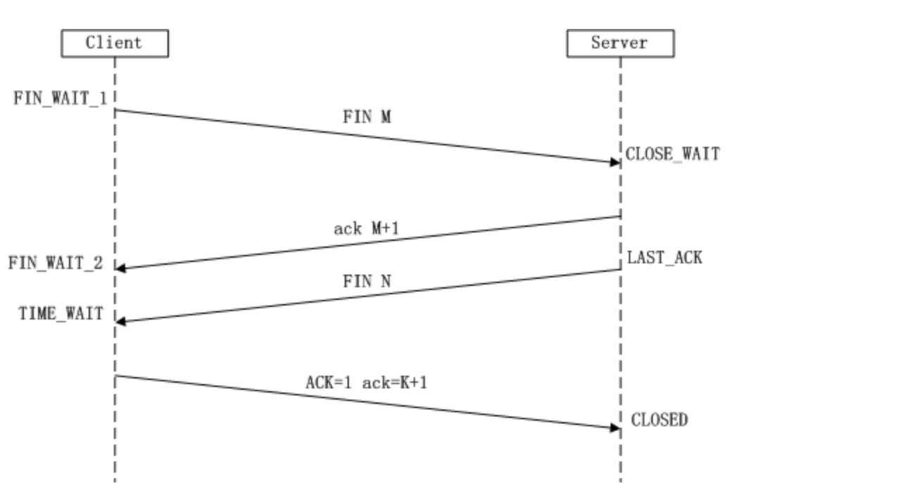

> 面试的时候被面试官问到八股文知识，答的不好，很多东西模棱两可，只是“我感觉”、“我觉得”远远不够。这次痛定思痛决定好好梳理一下。随着前端越来越卷，关于基础理论是必不可少的一环，“面试造火箭，入职拧螺丝”，虽然是私下嘲讽目前风气的梗，但是对于严谨的工作态度和扎实的基础知识还是要掌握的，如果连八股文都掌握不清，还谈什么好好工作呢。面试官有时要的是一个态度，并不全是八股文（个人理解，非喜勿喷，^_^）。言归正传，开撸！

## 1. HTTP 和 HTTPS

### 1.http 和 https 的基本概念
http: 是一个客户端和服务器端请求和应答的标准（TCP），用于从 WWW 服务器传输超文本到本地浏览器的超文本传输协议。
https:是以安全为目标的 HTTP 通道，即 HTTP 下 加入 SSL 层进行加密。其作用是：建立一个信息安全通道，来确保数据的传输，确保网站的真实性。

### 2. http 和 https 的区别及优缺点？

* http 是超文本传输协议，信息是明文传输，HTTPS 协议要比 http 协议安全，https 是具有安全性的 ssl 加密传输协议，可防止数据在传输过程中被窃取、改变，确保数据的完整性(当然这种安全性并非绝对的，对于更深入的 Web 安全问题，此处暂且不表)。
* http 协议的默认端口为 80，https 的默认端口为 443。
* http 的连接很简单，是无状态的。https 握手阶段比较费时，会使页面加载时间延长 50%，增加 10%~20%的耗电。
* https **缓存**不如 http 高效，会增加数据开销。
* Https 协议需要 **ca** 证书，费用较高，功能越强大的证书费用越高。
* SSL 证书需要绑定 **IP**，不能再同一个 IP 上绑定多个域名，IPV4 资源支持不了这种消耗。

### 3.https 协议的工作原理
客户端在使用 HTTPS 方式与 Web 服务器通信时有以下几个步骤：

1. 客户端使用 https url 访问服务器，则要求 web 服务器**建立 ssl 链接**。
2. web 服务器接收到客户端的请求之后，会**将网站的证书（证书中包含了公钥），传输给客户端**。
3. 客户端和 web 服务器端开始协商 **SSL 链接的安全等级**，也就是加密等级。
4. 客户端浏览器通过双方协商一致的安全等级，**建立会话密钥**，然后通过网站的公钥来加密会话密钥，并传送给网站。
5. web 服务器通过自己的私钥**解密出会话密钥**。
6. web 服务器**通过会话密钥加密与客户端之间的通信**。

传送门 ☞ # [解读 HTTP1/HTTP2/HTTP3](https://juejin.cn/post/6995109407545622542)

## TCP三次握手
1. 第一次握手：**建立连接时，客户端发送syn包（syn=j）到服务器，并进入SYN_SENT状态，等待服务器确认**；SYN：同步序列编号（Synchronize Sequence Numbers）。
2. 第二次握手：**服务器收到syn包并确认客户的SYN（ack=j+1）**，**同时也发送一个自己的SYN包**（syn=k），即SYN+ACK包，此时服务器进入SYN_RECV状态；
3. 第三次握手：**客户端收到服务器的SYN+ACK包，向服务器发送确认包ACK(ack=k+1）**，此包发送完毕，客户端和服务器进入ESTABLISHED（TCP连接成功）状态，完成三次握手。

握手过程中传送的包里不包含数据，三次握手完毕后，客户端与服务器才正式开始传送数据。

## TCP四次挥手


1. 第一次挥手：Client发送一个**FIN**，用来关闭Client到Server的数据传送，Client进入**FIN_WAIT_1状态** 。
2. 第二次挥手：Server收到FIN后 ，发送一个ACK给Client，确认序号为收到序号+1（与SYN相同，一个FIN占用一个序号），Server进入CLOSE_WAIT状态 。
3. 第三次挥手：Server发送一个FIN，用来关闭Server到Client的数据传送，Server进入LAST_ACK状态。
4. 第四次挥手：Client收到FIN后，Client进入TIME_WAIT状态，接着发送一个ACK给Server，确认序号为收到序号+1 ， Server进入CLOSED状态， 完成四次挥手。

### 为什么建立连接是三次握手，而关闭连接却是四次挥手呢？
这是因为服务端在LISTEN状态下，收到建立连接请求的SYN报文后，把ACK和SYN放在一个报文里发送给客户端。而关闭连接时，当收到对方的FIN报文时，仅仅表示对方不再发送数据了但是还能接收数据，己方也未必全部数据都发送给对方了，所以己方可以立即close，也可以发送一些数据给对方后，再发送FIN报文给对方来表示同意现在关闭连接，因此，己方ACK和FIN一般都会分开发送。

## TCP和UDP的区别
1. TCP是面向**链接**的，而UDP是面向**无连接**的。
2. TCP仅支持**单播传输**，UDP 提供了**单播，多播，广播**的功能。
3. TCP的三次握手保证了连接的**可靠性**; UDP是无连接的、不可靠的一种数据传输协议，首先不可靠性体现在无连接上，通信都不需要建立连接，对接收到的数据也不发送确认信号，发送端不知道数据是否会正确接收。
4. UDP的**头部开销**比TCP的更小，数据**传输速率更高，实时性更好**。

## HTTP 请求跨域问题
1. 跨域的原理
**跨域**，是指浏览器不能执行其他网站的脚本。它是由浏览器的**同源策略**造成的。
**同源策略**,是浏览器对 JavaScript 实施的安全限制，只要**协议、域名、端口**有任何一个不同，都被当作是不同的域。
**跨域原理**，即是通过各种方式，**避开浏览器的安全限制**。

2.解决方案
最初做项目的时候，使用的是jsonp，但存在一些问题，使用get请求不安全，携带数据较小，后来也用过iframe，但只有主域相同才行，也是存在些问题，后来通过了解和学习发现使用代理和proxy代理配合起来使用比较方便，就引导后台按这种方式做下服务器配置，在开发中使用proxy，在服务器上使用nginx代理，这样开发过程中彼此都方便，效率也高；现在h5新特性还有 windows.postMessage()

* JSONP：
ajax 请求受同源策略影响，不允许进行跨域请求，而 script 标签 src 属性中的链 接却可以访问跨域的 js 脚本，利用这个特性，服务端不再返回 JSON 格式的数据，而是 返回一段调用某个函数的 js 代码，在 src 中进行了调用，这样实现了跨域。

步骤：

去创建一个script标签
script的src属性设置接口地址
接口参数，必须要带一个自定义函数名，要不然后台无法返回数据
通过定义函数名去接受返回的数据

```js
//动态创建 script
var script = document.createElement('script');

// 设置回调函数
function getData(data) {
    console.log(data);
}

//设置 script 的 src 属性，并设置请求地址
script.src = 'http://localhost:3000/?callback=getData';

// 让 script 生效
document.body.appendChild(script);
```

**JSONP 的缺点:**
JSON 只支持 get，因为 script 标签只能使用 get 请求； JSONP 需要后端配合返回指定格式的数据。

* **document.domain** 基础域名相同 子域名不同
* **window.name** 利用在一个浏览器窗口内，载入所有的域名都是共享一个window.name
* **CORS** CORS(Cross-origin resource sharing)跨域资源共享 服务器设置对CORS的支持原理：服务器设置Access-Control-Allow-Origin HTTP响应头之后，浏览器将会允许跨域请求
* **proxy代理** 目前常用方式,通过服务器设置代理
* **window.postMessage()** 利用h5新特性window.postMessage()

## Cookie、sessionStorage、localStorage 的区别

**相同点：** 存储在客户端
**不同点：** 
* cookie数据大小不能超过4k；sessionStorage和localStorage的存储比cookie大得多，可以达到5M+
* cookie设置的过期时间之前一直有效；localStorage永久存储，浏览器关闭后数据不丢失除非主动删除数据；sessionStorage数据在当前浏览器窗口关闭后自动删除
* cookie的数据会自动的传递到服务器；sessionStorage和localStorage数据保存在本地

## 浏览器

### 从输入URL到页面加载的全过程


1. 首先在浏览器中输入URL
2. 查找缓存：浏览器先查看浏览器缓存-系统缓存-路由缓存中是否有该地址页面，如果有则显示页面内容。如果没有则进行下一步。

* 浏览器缓存：浏览器会记录DNS一段时间，因此，只是第一个地方解析DNS请求；
* 操作系统缓存:如果在浏览器缓存中不包含这个记录，则会使系统调用操作系统， 获取操作系统的记录(保存最近的DNS查询缓存)；
* 路由器缓存：如果上述两个步骤均不能成功获取DNS记录，继续搜索路由器缓存；
* ISP缓存：若上述均失败，继续向ISP搜索。

3. DNS域名解析：浏览器向DNS服务器发起请求，解析该URL中的域名对应的IP地址。**DNS服务器是基于UDP的，因此会用到UDP协议**。
4. 建立TCP连接：解析出IP地址后，根据IP地址和默认80端口，和服务器建立TCP连接
5. 发起HTTP请求：浏览器发起读取文件的HTTP请求，，该请求报文作为TCP三次握手的第三次数据发送给服务器
6. 服务器响应请求并返回结果：服务器对浏览器请求做出响应，并把对应的html文件发送给浏览器
7. 关闭TCP连接：通过四次挥手释放TCP连接
8. 浏览器渲染：客户端（浏览器）解析HTML内容并渲染出来，浏览器接收到数据包后的解析流程为：

* 构建DOM树：词法分析然后解析成DOM树（dom tree），是由dom元素及属性节点组成，树的根是document对象
* 构建CSS规则树：生成CSS规则树（CSS Rule Tree）
* 构建render树：Web浏览器将DOM和CSSOM结合，并构建出渲染树（render tree）
* 布局（Layout）：计算出每个节点在屏幕中的位置
* 绘制（Painting）：即遍历render树，并使用UI后端层绘制每个节点。

9. JS引擎解析过程：调用JS引擎执行JS代码（JS的解释阶段，预处理阶段，执行阶段生成执行上下文，VO，作用域链、回收机制等等）

* 创建window对象：window对象也叫全局执行环境，当页面产生时就被创建，所有的全局变量和函数都属于window的属性和方法，而DOM Tree也会映射在window的doucment对象上。当关闭网页或者关闭浏览器时，全局执行环境会被销毁。
* 加载文件：完成js引擎分析它的语法与词法是否合法，如果合法进入预编译
* 预编译：在预编译的过程中，浏览器会寻找全局变量声明，把它作为window的属性加入到window对象中，并给变量赋值为'undefined'；寻找全局函数声明，把它作为window的方法加入到window对象中，并将函数体赋值给他（匿名函数是不参与预编译的，因为它是变量）。而变量提升作为不合理的地方在ES6中已经解决了，函数提升还存在。
* 解释执行：执行到变量就赋值，如果变量没有被定义，也就没有被预编译直接赋值，在ES5非严格模式下这个变量会成为window的一个属性，也就是成为全局变量。string、int这样的值就是直接把值放在变量的存储空间里，object对象就是把指针指向变量的存储空间。函数执行，就将函数的环境推入一个环境的栈中，执行完成后再弹出，控制权交还给之前的环境。JS作用域其实就是这样的执行流机制实现的。


### 浏览器重绘与重排的区别？
**重排/回流（Reflow）**：当DOM的变化影响了元素的几何信息，浏览器需要重新计算元素的几何属性，将其安放在界面中的正确位置，这个过程叫做重排。表现为重新生成布局，重新排列元素。
**重绘(Repaint)**: 当一个元素的外观发生改变，但没有改变布局,重新把元素外观绘制出来的过程，叫做重绘。表现为某些元素的外观被改变

单单改变元素的外观，肯定不会引起网页重新生成布局，但当浏览器完成重排之后，将会重新绘制受到此次重排影响的部分
重排和重绘代价是高昂的，它们会破坏用户体验，并且让UI展示非常迟缓，而相比之下重排的性能影响更大，在两者无法避免的情况下，一般我们宁可选择代价更小的重绘。
『重绘』不一定会出现『重排』，『重排』必然会出现『重绘』。

### 如何触发重排和重绘？
任何改变用来构建渲染树的信息都会导致一次重排或重绘：

* 添加、删除、更新DOM节点
* 通过display: none隐藏一个DOM节点-触发重排和重绘
* 通过visibility: hidden隐藏一个DOM节点-只触发重绘，因为没有几何变化
* 移动或者给页面中的DOM节点添加动画
* 添加一个样式表，调整样式属性
* 用户行为，例如调整窗口大小，改变字号，或者滚动。

### 如何避免重绘或者重排？

1.集中改变样式，不要一条一条地修改 DOM 的样式。

2.不要把 DOM 结点的属性值放在循环里当成循环里的变量。

3.为动画的 HTML 元件使用 fixed 或 absoult 的 position，那么修改他们的 CSS 是不会 reflow 的。

4.不使用 table 布局。因为可能很小的一个小改动会造成整个 table 的重新布局。

5.尽量只修改position：absolute或fixed元素，对其他元素影响不大

6.动画开始GPU加速，translate使用3D变化

7.提升为合成层

将元素提升为合成层有以下优点：

* 合成层的位图，会交由 GPU 合成，比 CPU 处理要快
* 当需要 repaint 时，只需要 repaint 本身，不会影响到其他的层
* 对于 transform 和 opacity 效果，不会触发 layout 和 paint

提升合成层的最好方式是使用 CSS 的 will-change 属性：

```css
#target {
  will-change: transform;
}
```

### 介绍下304过程

* a. 浏览器请求资源时首先命中资源的Expires 和 Cache-Control，Expires 受限于本地时间，如果修改了本地时间，可能会造成缓存失效，可以通过Cache-control: max-age指定最大生命周期，状态仍然返回200，但不会请求数据，在浏览器中能明显看到from cache字样。
* b. 强缓存失效，进入协商缓存阶段，首先验证ETagETag可以保证每一个资源是唯一的，资源变化都会导致ETag变化。服务器根据客户端上送的If-None-Match值来判断是否命中缓存。
* c. 协商缓存Last-Modify/If-Modify-Since阶段，客户端第一次请求资源时，服务服返回的header中会加上Last-Modify，Last-modify是一个时间标识该资源的最后修改时间。再次请求该资源时，request的请求头中会包含If-Modify-Since，该值为缓存之前返回的Last-Modify。服务器收到If-Modify-Since后，根据资源的最后修改时间判断是否命中缓存。

### 浏览器的缓存机制 强制缓存 && 协商缓存

浏览器与服务器通信的方式为应答模式，即是：浏览器发起HTTP请求 – 服务器响应该请求。那么浏览器第一次向服务器发起该请求后拿到请求结果，会根据响应报文中HTTP头的缓存标识，决定是否缓存结果，是则将请求结果和缓存标识存入浏览器缓存中，简单的过程如下图：


由上图我们可以知道：

浏览器每次发起请求，都会**先在浏览器缓存中查找该请求的结果以及缓存标识**
浏览器每次拿到返回的请求结果都会**将该结果和缓存标识存入浏览器缓存中**

以上两点结论就是浏览器缓存机制的关键，他确保了每个请求的缓存存入与读取，只要我们再理解浏览器缓存的使用规则，那么所有的问题就迎刃而解了。为了方便理解，这里根据是否需要向服务器重新发起HTTP请求将缓存过程分为两个部分，分别是**强制缓存**和**协商缓存**。

* **强制缓存**

**强制缓存就是向浏览器缓存查找该请求结果，并根据该结果的缓存规则来决定是否使用该缓存结果的过程。**当浏览器向服务器发起请求时，服务器会将缓存规则放入HTTP响应报文的HTTP头中和请求结果一起返回给浏览器，控制强制缓存的字段分别是 **Expires** 和 **Cache-Control**，其中Cache-Control优先级比Expires高。
强制缓存的情况主要有三种(暂不分析协商缓存过程)，如下：

 1. 不存在该缓存结果和缓存标识，强制缓存失效，则直接向服务器发起请求（跟第一次发起请求一致）。
 2. 存在该缓存结果和缓存标识，但该结果已失效，强制缓存失效，则使用协商缓存。
 3. 存在该缓存结果和缓存标识，且该结果尚未失效，强制缓存生效，直接返回该结果


* **协商缓存**

**协商缓存就是强制缓存失效后，浏览器携带缓存标识向服务器发起请求，由服务器根据缓存标识决定是否使用缓存的过程**，同样，协商缓存的标识也是在响应报文的HTTP头中和请求结果一起返回给浏览器的，控制协商缓存的字段分别有：**Last-Modified / If-Modified-Since** 和 **Etag / If-None-Match**，其中Etag / If-None-Match的优先级比Last-Modified / If-Modified-Since高。协商缓存主要有以下两种情况：

* 协商缓存生效，返回304
* 协商缓存失效，返回200和请求结果结果

传送门 ☞ # [彻底理解浏览器的缓存机制](https://juejin.cn/post/6992843117963509791)


### 说下进程、线程和协程
**进程**是一个具有一定独立功能的程序在一个数据集上的一次动态执行的过程，**是操作系统进行资源分配和调度的一个独立单位**，是应用程序运行的载体。进程是一种抽象的概念，从来没有统一的标准定义。

**线程**是程序执行中一个单一的顺序控制流程，是**程序执行流的最小单元**，是处理器调度和分派的基本单位。一个进程可以有一个或多个线程，各个线程之间共享程序的内存空间(也就是所在进程的内存空间)。一个标准的线程由线程ID、当前指令指针(PC)、寄存器和堆栈组成。而进程由内存空间(代码、数据、进程空间、打开的文件)和一个或多个线程组成。

**协程**，英文Coroutines，是一种**基于线程之上，但又比线程更加轻量级的存在**，这种由程序员自己写程序来管理的轻量级线程叫做『用户空间线程』，具有对内核来说不可见的特性。


**进程和线程的区别与联系**

【区别】：
    调度：线程作为调度和分配的基本单位，进程作为拥有资源的基本单位；
    并发性：不仅进程之间可以并发执行，同一个进程的多个线程之间也可并发执行；
    拥有资源：进程是拥有资源的一个独立单位，线程不拥有系统资源，但可以访问隶属于进程的资源。
    系统开销：在创建或撤消进程时，由于系统都要为之分配和回收资源，导致系统的开销明显大于创建或撤消线程时的开销。但是进程有独立的地址空间，一个进程崩溃后，在保护模式下不会对其它进程产生影响，而线程只是一个进程中的不同执行路径。线程有自己的堆栈和局部变量，但线程之间没有单独的地址空间，一个进程死掉就等于所有的线程死掉，所以多进程的程序要比多线程的程序健壮，但在进程切换时，耗费资源较大，效率要差一些。
【联系】：
    一个线程只能属于一个进程，而一个进程可以有多个线程，但至少有一个线程；
    资源分配给进程，同一进程的所有线程共享该进程的所有资源；
    处理机分给线程，即真正在处理机上运行的是线程；
    线程在执行过程中，需要协作同步。不同进程的线程间要利用消息通信的办法实现同步。


## HTML && CSS

### HTML5 新特性、语义化

1. 概念：
HTML5的语义化指的是**合理正确的使用语义化的标签来创建页面结构**。【正确的标签做正确的事】

2. 语义化标签：
header nav main article section aside footer

3. 语义化的优点:

 * 在**没CSS样式的情况下，页面整体也会呈现很好的结构效果**
 * **代码结构清晰**，易于阅读，
 * **利于开发和维护** 方便其他设备解析（如屏幕阅读器）根据语义渲染网页。
 * **有利于搜索引擎优化（SEO）**，搜索引擎爬虫会根据不同的标签来赋予不同的权重


### CSS 选择器及优先级

**选择器**

 * id选择器(#myid)
 * 类选择器(.myclass)
 * 属性选择器(a[rel="external"])
 * 伪类选择器(a:hover, li:nth-child)
 * 标签选择器(div, h1,p)
 * 相邻选择器（h1 + p）
 * 子选择器(ul > li)
 * 后代选择器(li a)
 * 通配符选择器(*)

**优先级：**
 * !important
 * 内联样式（1000）
 * ID选择器（0100）
 * 类选择器/属性选择器/伪类选择器（0010）
 * 元素选择器/伪元素选择器（0001）
 * 关系选择器/通配符选择器（0000）  

 带!important 标记的样式属性优先级最高； 样式表的来源相同时：**!important > 行内样式>ID选择器 > 类选择器 > 标签 > 通配符 > 继承 > 浏览器默认属性**

 ### position 属性的值有哪些及其区别
**固定定位 fixed：** 元素的位置相对于浏览器窗口是固定位置，即使窗口是滚动的它也不会移动。Fixed 定 位使元素的位置与文档流无关，因此不占据空间。 Fixed 定位的元素和其他元素重叠。
**相对定位 relative：** 如果对一个元素进行相对定位，它将出现在它所在的位置上。然后，可以通过设置垂直 或水平位置，让这个元素“相对于”它的起点进行移动。 在使用相对定位时，无论是 否进行移动，元素仍然占据原来的空间。因此，移动元素会导致它覆盖其它框。
**绝对定位 absolute：** 绝对定位的元素的位置相对于最近的已定位父元素，如果元素没有已定位的父元素，那 么它的位置相对于。absolute 定位使元素的位置与文档流无关，因此不占据空间。 absolute 定位的元素和其他元素重叠。
**粘性定位 sticky：** 元素先按照普通文档流定位，然后相对于该元素在流中的 flow root（BFC）和 containing block（最近的块级祖先元素）定位。而后，元素定位表现为在跨越特定阈值前为相对定 位，之后为固定定位。
**默认定位 Static：** 默认值。没有定位，元素出现在正常的流中（忽略 top, bottom, left, right 或者 z-index 声 明）。 inherit: 规定应该从父元素继承 position 属性的值。

### box-sizing属性

box-sizing 规定两个并排的带边框的框，语法为 box-sizing：content-box/border-box/inherit
**content-box：** 宽度和高度分别应用到元素的内容框，在宽度和高度之外绘制元素的内边距和边框。【标准盒子模型】
**border-box：** 为元素设定的宽度和高度决定了元素的边框盒。【IE 盒子模型】
**inherit：** 继承父元素的 box-sizing 值。


### CSS 盒子模型

CSS 盒模型本质上是一个盒子，它包括：边距，边框，填充和实际内容。CSS 中的盒子模型包括 IE 盒子模型和标准的 W3C 盒子模型。
在标准的盒子模型中，**width 指 content 部分的宽度**。
在 IE 盒子模型中，**width 表示 content+padding+border 这三个部分的宽度**。

故在计算盒子的宽度时存在差异：
**标准盒模型：** 一个块的总宽度 = width+margin(左右)+padding(左右)+border(左右)
**怪异盒模型：** 一个块的总宽度 = width+margin（左右）（既 width 已经包含了 padding 和 border 值）


### BFC（块级格式上下文）
#### BFC的概念
**BFC** 是 **Block Formatting Context** 的缩写，即块级格式化上下文。BFC是CSS布局的一个概念，是一个独立的渲染区域，规定了内部box如何布局， 并且这个区域的子元素不会影响到外面的元素，其中比较重要的布局规则有内部 box 垂直放置，计算 BFC 的高度的时候，浮动元素也参与计算。

#### BFC的原理布局规则
