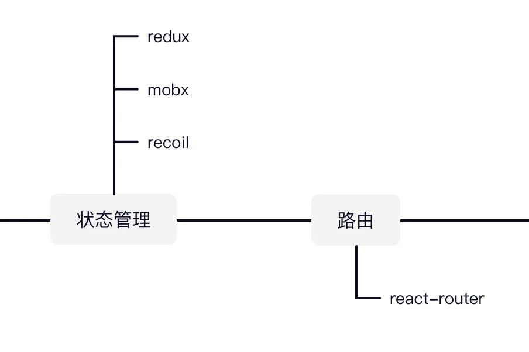
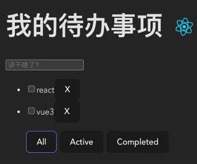
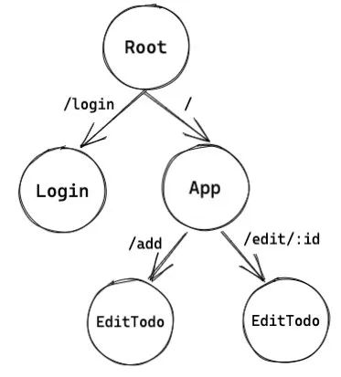
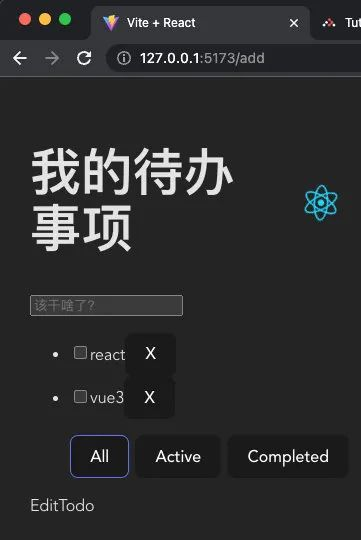
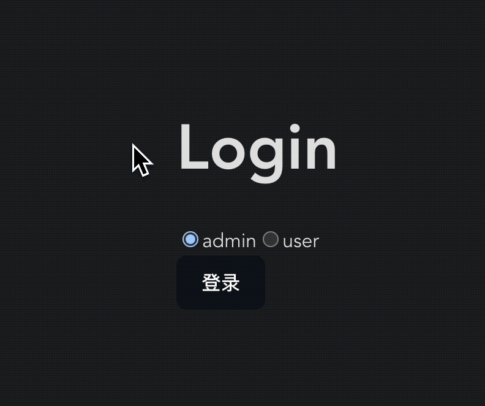
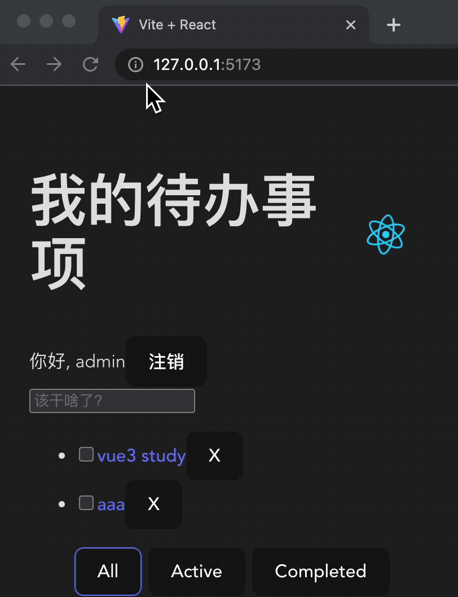
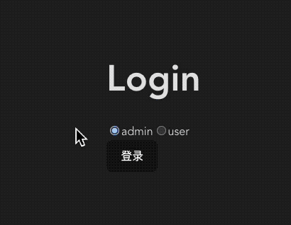
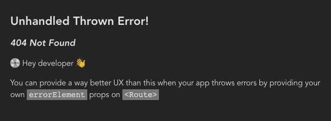

## 写在前面 
> 本章节简单介绍了router 和 redux 的使用及封装方式，具体深入了解后续再更新 [代码直通车](https://github.com/xizijian/todolist/tree/main/react-todolist/todolist)


#### 知识点

- 如何引入react-router
- 声明多个页面并灵活跳转
- 嵌套路由的使用场景
- 路由action的使用
- 通过Form简化表单逻辑
- 控制页面访问权限
- 控制按钮访问权限
- 保存登录状态
- 路由错误处理
- ...

#### 引入路由库 react-router 
路由功能我们使用react-router实现，目前版本v6.x。

我们首先安装：浏览器平台安装**react-router-dom**即可

```s
yarn add react-router-dom
```

下面添加一个**Router**：浏览器平台我们需要创建**BrowserRouter**，main.jsx：

```jsx
import {
  RouterProvider,
} from "react-router-dom";
import router from './routes'

ReactDOM.createRoot(document.getElementById('root')).render(
  <Provider store={store}>
    <React.StrictMode>
      <RouterProvider router={router} />
    </React.StrictMode>
  </Provider>
)
```

这里**router**我们在routes/index.jsx中创建：
```jsx
import {
  createBrowserRouter,
} from "react-router-dom";
import App from '../App'

const router = createBrowserRouter([
  {
    path: "/",
    element: <App></App>,
  },
]);

export default router;
```

现在我们的应用应该可以和之前一样正常显示


#### 规划页面路由关系

下面我们重新规划页面路由关系：

- 登录页面Login：登录完可以区分用户身份；
- 应用页面App：之前的待办页面，显示列表，新增按钮，过滤按钮等；
- 编辑待办EditTodo：编辑待办事项的表单页面，新增待办事项也可以复用。

它们之间的组织关系如下：可以看出 **/add** 和 **/edit/:id** 是/的嵌套子路由


声明这些路由：
```jsx
import Login from "../Login";
import EditTodo from "../EditTodo";

const router = createBrowserRouter([
  {
    path: "/",
    element: <App></App>,
    children: [
      {
        path: "/edit/:id",
        element: <EditTodo></EditTodo>,
      },
      {
        path: "/add",
        element: <EditTodo></EditTodo>,
      },
    ],
  },
  {
    path: "/login",
    element: <Login></Login>,
  },
]);
```

定义一下Login和EditTodo
```jsx
export default function Login() {
  return (
    <div>
      <h1>Login</h1>
      <button>登录</button>
    </div>
  )
}
```

```jsx
export default function EditTodo() {
  return (
    <div>EditTodo</div>
  )
}
```

然后我们输入 **/login** 测试一下登录页


#### 嵌套路由
想要看到**EditTodo**，需要给**App.jsx**添加路由出口：

```jsx
import { Outlet } from "react-router-dom";

function App() {
  return (
    <div className="App">
      {/* ... */}
      {/* 嵌套路由出口 */}
      <Outlet></Outlet>
    </div>
  );
}
```

输入/add或者/edit/id测试一下编辑页：看到EditTodo就ok了！


#### 路由跳转
需要路由跳转的地方有两处：

- 登录页：登录成功之后跳转待办列表；
- 待办列表：点击编辑或新增待办；注销登录。

#### 登录页跳转
react-router提供 **useNavigate()** 方式进行命令式导航，我们来看一下如何实现，Login.jsx：

```jsx
import { useNavigate } from "react-router-dom";
export default function Login() {
  // 使用useNavigate进行命令式导航
  const navigate = useNavigate()
  
  function onLogin() {
    // 路由跳转
    navigate('/')
  }
  return (
    <div>
      <button onClick={onLogin}>登录</button>
    </div>
  );
}
```

#### 待办列表跳转
还有另一种跳转链接方式，比较适合用在待办列表中，TodoList.jsx：

```jsx
{/* <span onDoubleClick={() => editTodo(todo)}>{todo.title}</span> */}
<Link to={`/edit/${todo.id}`}>{todo.title}</Link>
```

再配合**useParams()**，即可获取参数以便后续编辑操作，EditTodo.jsx

```jsx
import { useParams } from "react-router-dom"

export default function EditTodo() {
  let {id} = useParams()
  return (
    <div>EditTodo：{id}</div>
  )
}
```

#### 页面权限控制
下面我们引入页面权限控制，用户登录后才能查看App页面。

我们假设有**admin**和**user**两种用户角色，在登录时选择，Login.jsx

```jsx
import { useState } from "react";
import { useDispatch } from "react-redux";
import { useNavigate } from "react-router-dom";
import { setRole } from "./store/userSlice";

export default function Login() {
  // 添加用户角色状态
  const [role, setUserRole] = useState("admin");
 // 修改全局中角色状态
  const dispatch = useDispatch();

  const onLogin = () => {
    // 设置用户角色
    dispatch(setRole(role))
    // ..
  }

  return (
    <div>
      <h1>Login</h1>
      <div>
        <input
          type="radio"
          name="role"
          value="admin"
          checked={role === "admin"}
          onChange={() => setUserRole("admin")}
        />
        admin
        <input
          type="radio"
          name="role"
          value="user"
          checked={role === "user"}
          onChange={() => setUserRole("user")}
        />
        user
      </div>
      <button onClick={onLogin}>登录</button>
    </div>
  );
}
```

保存角色状态，userSlice.js

```jsx
import { createSlice } from "@reduxjs/toolkit";

const userSlice = createSlice({
  name: "user",
  initialState: {
    role: '',
  },
  reducers: {
    setRole: (state, { payload }) => {
      state.role = payload
    }
  },
});

export const selectRole = (state) => state.user.role;
export const { setRole } = userSlice.actions;
export default userSlice.reducer;

```

注册reducer

```jsx
import user from './userSlice'

const store = configureStore({
  reducer: {
    user
  }
})
```

App中显示角色并能够注销

```jsx
import { useDispatch, useSelector } from "react-redux";
import { selectRole, setRole } from "./store/userSlice";

function App() {
  const role = useSelector(selectRole)
  const dispatch = useDispatch()
  const navigate = useNavigate()
  function onLogout() {
    // 清空角色
    dispatch(setRole(''))
    // 跳转登录页
    navigate('/login')
  }
  
  return (
    <div className="App">
      {/* ... */}
      <div>
        你好, {role}
        <button onClick={onLogout}>注销</button>
      </div>
```

测试效果


#### 页面访问权限控制

如果用户没有登录就不能访问App.jsx的内容且应该重定向到登录页，下面我们看一下实现思路：

实现一个RequireAuth组件，能够校验用户登录态，没有登录重定向，登录则显示内容
将RequireAuth作为需要保护的路由组件的父组件包起来

先看看**RequireAuth**：

```jsx
import { useSelector } from "react-redux";
import { Navigate, useLocation } from "react-router-dom";
import { selectLogin } from "./store/userSlice";

export default function RequireAuth({ children }) {
  // 检查用户是否登录
  let isLogin = useSelector(selectLogin);
  // 获取当前url地址
  let location = useLocation();

  if (!isLogin) {
    // 如果未登录重定向到 /login 页面, 同时保存当前location以便登录成功之后回跳回来
    return <Navigate to="/login" state={{ from: location }} replace />;
  }
 // 如果登录显示RequireAuth孩子内容
  return children;
}
```

将App组件包起来，以保护它，routes/index.jsx：

```jsx
const router = createBrowserRouter([
  {
    path: "/",
    element: (
      <RequireAuth>
        <App></App>
      </RequireAuth>
    ),
```

现在刷新页面会自动跳回登录页：



#### 按钮权限控制
最后我们还有一个需求：只有admin角色的用户才能创建或删除待办事项。

这实际上是一个按钮权限，如果用户是admin：

- 才渲染NewTodo组件
- 才渲染删除按钮

这样就实现了按钮级别的权限控制，聪明的你应该已经有了主意！

对了！我们同样创建一个包装组件，判断用户是否拥有所需角色，创建**AuthWrapper.jsx**

```jsx
import { useSelector } from "react-redux";
import { selectRole } from "./store/userSlice";

// 接收roles为所需角色
export default function AuthWrapper({ children, roles = [] }) {
  // 获取用户角色
  const role = useSelector(selectRole);

  let auth = false
  // 如果没有传递roles，表明没有限制
  // 如果用户拥有所需角色，表明可以展示内容
  if (roles.length === 0 || roles.includes(role)) {
    auth = true
  }
  // 如果没有授权，则什么也不显示
  if (!auth) {
    return null
  }
 // 如果拥有权限显示孩子内容
  return children;
}
```

包装一下新增组件和删除按钮：
```jsx
<AuthWrapper roles={['admin']}>
 <AddTodo></AddTodo>
</AuthWrapper>
```

```jsx
<AuthWrapper roles={['admin']}>
  <button
    className="destroy"
    onClick={() => dispatch(removeTodo(todo.id))}
    >X
  </button>
</AuthWrapper>
```

效果如下：


#### 错误处理

**react-router**默认就有错误处理，比如我们胡乱输入一个不存在的地址，然后就会显示一个**404 Not Found**错误：



但是就像里面信息提示的一样，我们并未处理这个抛出的错误。实际上我们可以用一种更好的方式改善用户体验，而不是显示这个给开发者看的页面。

因此，我们提供一个错误页面给react-router，error-page.jsx：

```jsx
import { useRouteError } from "react-router-dom";

export default function ErrorPage() {
  const error = useRouteError();
  console.error(error);

  return (
    <div id="error-page">
      <h1>啊哦!</h1>
      <p>实在抱歉，页面显示发生了点意外情况，要不咱再试试？</p>
      <p>
        <i>{error.statusText || error.message}</i>
      </p>
    </div>
  );
}
```

然后，将错误页设置给顶层路由，routes/index.js

```jsx
import ErrorPage from "../ErrorPage";

const router = createBrowserRouter([
  {
    path: "/",
    element: <RequireAuth><App></App></RequireAuth>,
    // 加在这里
    errorElement: <ErrorPage></ErrorPage>,
```

刷新一下再看看，虽然还是不怎么样，总比刚才好了点。当然大家可以自由的创意一下！


#### 参考
[杨村长](https://juejin.cn/user/325111174926350) 