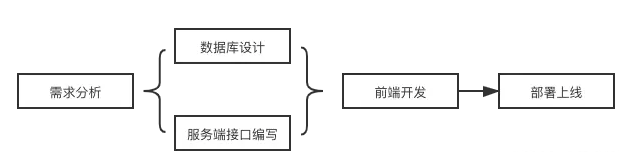
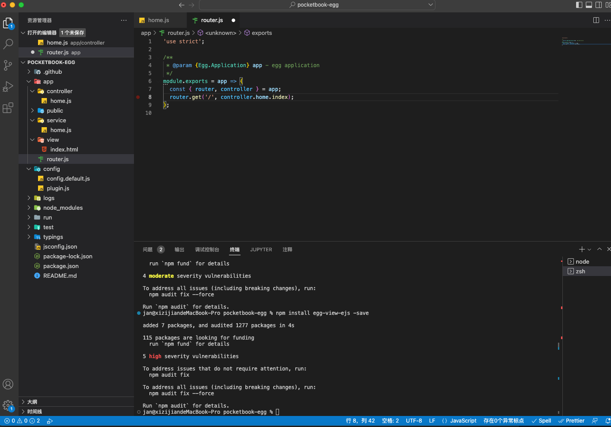
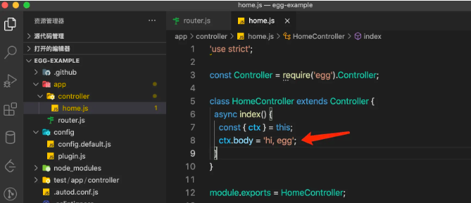
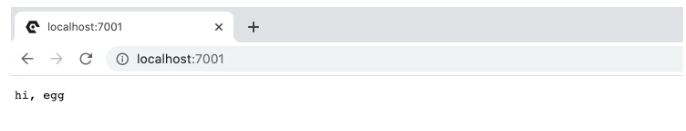
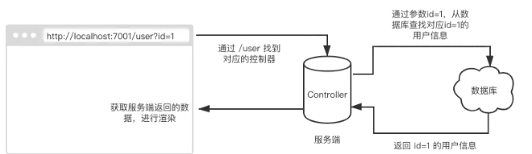
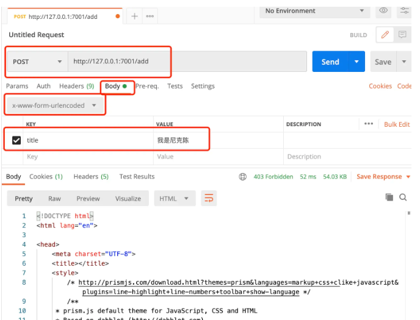
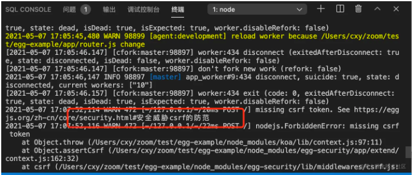
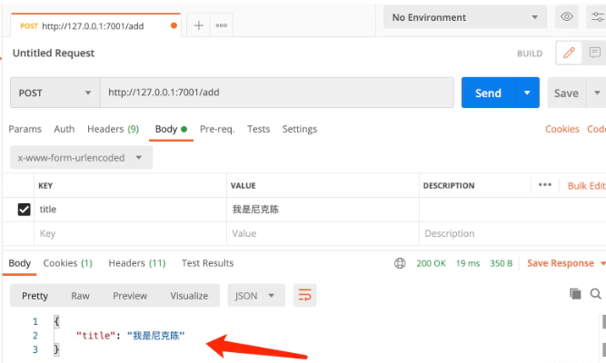
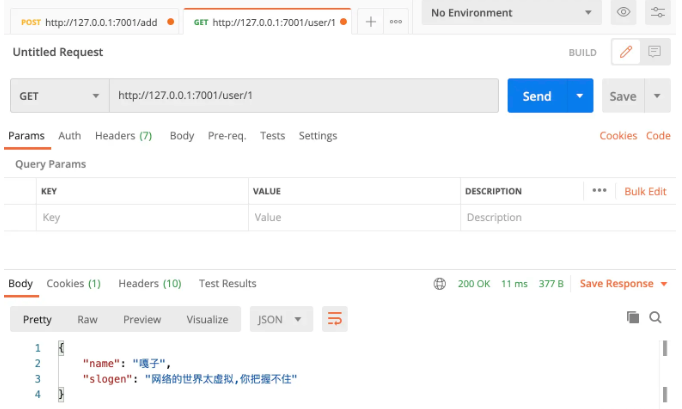
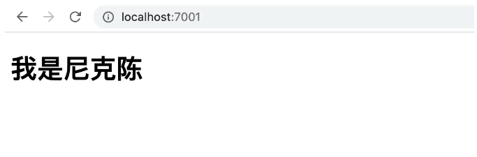

## 想说的话
> 随着互联网行情逐渐内卷，对于一个原生端转前端的开发来讲，仅仅只限于“前台”技术显然已经达不到现有市场的需求。没办法，大家一起
卷吧O(∩_∩)O。在平时的工作中，或多会少都会遇到一些问题，比如不知道自己还能学什么，每天像一只无头苍蝇一样，到处学一点。
打一枪换一个地，今天讲**Vue**，明天讲 **React**，后天讲 Webpack，面试文章更是让人心生焦虑，因为你看完之后，发现自己原来还有这么多不会的知识点，补到什么时候是个头。
大部分人焦虑的原因，归根结底还是因为自身的知识体系还不够完善，自身目前所处的高度还不够，导致看待问题的视野还比较模糊，我也一样。所以，需要对整个软件工程有一个全链路的学习，这样你的视野将升入新的高度，看待问题将不再局限于某个页面、用某个技术怎么实现。
偶然通过同事发现了掘金小册的一个[教程](https://juejin.cn/book/6966551262766563328/section/6967216402943967273)，对于对node及后端一无所知的我刚好适用，实战出真知，奥利给！

言归正传，计划半个月完成这个前后端独立实现的小项目(一个记账本功能)，采用Egg.js + React 技术栈，数据库MySQL，可视化工具[DBeaver](https://link.juejin.cn/?target=https%3A%2F%2Fdbeaver.io%2F) 在开发过程中期望能够梳理好一个大概体系，对后端有个初步了解。

## 什么是Node?它能干什么？
官网原话是：Node.js 不是一门新的编程语言，也不是一个 JavaScript 框架，**它是一套 JavaScript 运行环境，用来支持 JavaScript 代码的执行**。用编程术语来讲，Node.js 是一个 JavaScript 运行时（Runtime）。
我把它理解成为 在“服务器上跑的前端”。

#### Node能做些什么呢
* 爬虫
* 工具
* 脚本
* 硬件
* 中台
* 通信

#### 计划掌握流程


## 先从Egg.js开始

### Egg.js 简介
这里我们使用 Egg 为我们提供的脚手架生成指令，几行代码就能初始化一个 Egg 项目，如下：
```s
$ mkdir egg-example && cd egg-example
$ npm init egg --type=simple
$ npm i
```

效果如下：


### 目录结构

**Egg** 作为一套解决方案，它内部高度集成了封装好的项目目录结构，现代开发俗称“约定式开发”。正常情况下，你从 0 开始搭建一个 **Node** 服务端代码，需要结合很多工具插件来辅助完成项目的搭建，而 **Egg** 则提前为你提供好了这些繁琐的初始工作，让你能专心与业务层面的开发。

当然，“约定式开发”也有不好的地方，很多配置项都是内部约定好的，在你想要用到某一个功能时，你可能需要去查阅 Egg 的官方文档是如何配置的，这就会消耗一点时间，但是相比之下，使用它的利大于弊。

下面我们就先来认识一下，Egg 都为我们提供了哪些文件：

#### app/router.js

用于配置 URL 路由规则，比如上述初始化代码中的 **get** 请求，**npm run dev** 启动项目之后，你可以直接在浏览器中访问启动的端口 + 路径，默认是 http://localhost:7001 ，你将会拿到 **app/controller** 文件夹下，**home.js** 脚本中 index 方法返回的内容。



这就是路由配置的作用，抛出的形式有多种，如**router.get**、**router.post**、**router.delete**、**router.put** 等，都是支持的，更加具体的内容可阅读 [Router](https://link.juejin.cn/?target=https%3A%2F%2Feggjs.org%2Fzh-cn%2Fbasics%2Frouter.html) 配置。

#### app/controller/xx

用于解析用户的输入，处理后返回相应的结果。上述我们也提到了，通过请求路径将用户的请求基于 **method** 和 **URL** 分发到对应的 **Controller** 上，而 Controller 要做的事情就是响应用户的诉求。举个例子，我想拿到 A 用户的个人信息，于是我们要在控制器（Controller）里，通过请求携带的 A 用户的 id 参数，从数据库里获取指定用户的个人信息。如图所示：


上述是一个 **get** 接口，浏览器地址栏直接请求便可，通过 **/user** 路径，找到对应的控制器，这里需要提前定义好 **/user** 对应的控制器。控制器需要做的就是处理数据和响应请求返回数据。更加详细的描述请移步至 [Controller 文档](https://link.juejin.cn/?target=https%3A%2F%2Feggjs.org%2Fzh-cn%2Fbasics%2Fcontroller.html)

#### app/service/xx

简单来说，**Service** 就是在复杂业务场景下用于做业务逻辑封装的一个抽象层。上述初始化项目中未声明 **service** 文件夹，它是可选项，但是官方建议我们操作业务逻辑最好做一层封装。我们换一种理解方式，Service 层就是用于数据库的查询，我们尽量将粒度细化，这样以便多个 **Controller** 共同调用同一个 **Service**。后续我们链接数据库操作的时候，再进行详细分析。更加详细的描述请移步至 [Service 文档](https://link.juejin.cn/?target=https%3A%2F%2Feggjs.org%2Fzh-cn%2Fbasics%2Fservice.html)。

#### app/middleware/xx

用于编写中间件，中间件的概念就是在路由配置里设置了中间件的路由，每次请求命中后，都要过一层中间件。在我们后续的开发中，也会利用到这个中间件的原理做用户鉴权。当用户未登录的情况下，是不能调用某些接口的。

当然，你可以每次都在 **Controller** 判断，当前请求是否携带有效的用户认证信息。接口一多，到处都是这样的判断，逻辑重复。所以，中间件在某种程度上，也算是**优化代码结构的一种方式**。更加详细的描述请移步至 (Middleware 文档)[https://link.juejin.cn/?target=https%3A%2F%2Feggjs.org%2Fzh-cn%2Fbasics%2Fmiddleware.html]。

#### app/public/xx

用于放置静态资源。后续将会有一个上传静态资源的接口，包括图片、文本文档、excel、word等，都可以通过服务端读取文件之后，将其写入 **app/public** 文件夹中。在目前没有 **OSS** 服务的情况下，姑且先用这种方式存储静态资源，会消耗一点服务器的内存。

#### config/config.\{env}\.js

用于编写配置文件。目前项目只配置了 **config/config.default.js** 文件，这个是 **Egg** 框架约定好的，可以在内部设置一些全局的配置常量，在任何地方都可以通过 **app.config** 获取到 **config.default.js** 文件内的配置项。

#### config/plugin.js

用于配置需要加载的插件。比如 **egg-mysql**、**egg-cors**、**egg-jwt** 等官方提供的插件，也可以自己编写 Egg 插件，社区很多优秀的插件都可以在 Github 中搜到，[点击前往](https://github.com/topics/egg-plugin)。

### 编写基础的 GET 和 POST 接口
#### GET 请求参数获取

打开之前初始化的 **egg-example** 项目，通过 **npm run dev** 启动项目之后，浏览器添加如下请求地址：

```js
http://localhost:7001/?id=潘嘎之交
```

打开 **app/controller/home.js**，通过如下形式获取到浏览器查询参数。

```js
'use strict';

const Controller = require('egg').Controller;

class HomeController extends Controller {
  async index() {
    const { ctx } = this;
    const { id } = ctx.query;
    ctx.body = id;
  }
}

module.exports = HomeController;
```


还有另一种获取申明参数，比如我希望通过这样一个地址获取用户参数 **/user/5**，想获取用户 id 为 5 的用户信息。我们可以这样操作，首先添加路由，打开 **app/router.js** 添加一个路由：

```js
'use strict';

/**
 * @param {Egg.Application} app - egg application
 */
module.exports = app => {
  const { router, controller } = app;
  router.get('/', controller.home.index);
  router.get('/user/:id', controller.home.user);
};
```

其次在 **app/controller/home.js** 下添加一个 **user** 方法如下：

```js
'use strict';

const Controller = require('egg').Controller;

class HomeController extends Controller {
  async index() {
    const { ctx } = this;
    const { id } = ctx.query;
    ctx.body = id;
  }
  // 获取用户信息
  async user() {
    const { ctx } = this;
    const { id } = ctx.params; // 通过 params 获取申明参数
    ctx.body = id;
  }
}
module.exports = HomeController;
```

通过如下请求获取参数，打印在网页上：


通过上述操作，可以想到，其实用 **GET** 接口，就能把一切都做了，包括 **POST** 能做的，GET 也是可以轻松应对，只不过我们为了数据安全以及大小的限制，有些请求还是需要用 **POST** 来完成。所以市面上的面试题有关于 GET 和 POST 请求的区别，其实都是表象上的区别，而内在都是基于 **TCP** 协议，从理论上讲，可以说它们没差。

#### POST 请求参数获取
**POST** 接口需要借助 **Postman** 工具进行请求，因为通过浏览器无法手动发起 **POST** 请求，只能通过浏览器地址栏发起 **GET** 请求。所以这里大家可以去搜索引擎自行下载安装。我们来编写一个 **POST** 请求：

```js
// app/router.js
// ...
router.post('/add', controller.home.add);
```

```js
// app/controller/home.js
// post 请求方法
async add() {
  const { ctx } = this;
  const { title } = ctx.request.body;
  // Egg 框架内置了 bodyParser 中间件来对 POST 请求 body 解析成 object 挂载到 ctx.request.body 上
  ctx.body = {
    title
  };
}
```

打开 **Postman** 设置如下：


点击 「Send」按钮之后，控制台报错如下：


注意关键字**安全威胁 csrf 的防范**，简单说就是网络请求的安防策略，比如你 **Egg** 启动的是本地地址 http://127.0.0.1:7001 ，但是你请求的 **POST** 或 **GET** 接口是非本地计算机（别人的电脑），或者使用 **Postman** 发起请求，都会触发安防策略。

编程的过程就是解决问题的过程，不要怕麻烦，自己踩过坑之后，才能变得更加强大。

前往 **config/config.default.js** 做好白名单配置，这里我直接全部允许请求：

```js
config.security = {
  csrf: {
    enable: false,
    ignoreJSON: true
  },
  domainWhiteList: [ '*' ], // 配置白名单
};
```

重启项目，再次用 **Postman** 发起请求，如下所示：


成功拿到服务端返回的参数。

#### 从 Service 内获取数据

目前咱们还没有链接 **MySQL** 数据库，所以这边模拟一下在 **Service** 中获取数据库的数据。

在 **app** 目录下新建 **service**，并且创建一个 **home.js**，为其添加如下代码：

```js
// app/service/home.js
'use strict';

const Service = require('egg').Service;

class HomeService extends Service {
  async user() {
    // 假设从数据库获取的用户信息
    return {
      name: '嘎子',
      slogen: '网络的世界太虚拟,你把握不住'
    };
  }
}
module.exports = HomeService;
```

可以在 **Controller** 内拿到上述方法，如下所示：

```js
//  app/controller/home.js
// 获取用户信息
async user() {
  const { ctx } = this;
  const { name, slogen } = await ctx.service.home.user();
  ctx.body = {
    name,
    slogen
  }
}
```

打开 **Postman** 请求如下所示：


**HomeService** 中的 **user** 方法内部，在后续链接数据库之后，可以 **this** 上下文，拿到 **MySQL** 的实例方法，对数据库进行 **CRUD** 操作。


#### Egg.js 中使用前端模板

很多人可能没有经历过前端刀耕火种的年代(我也没有)，切换路由都是服务器直接出 **HTML** 页面，并且会刷新整个页面。不要小看这种形式，它的渲染速度在多数情况下是比当代的单页面开发形式的网页要快一些的。

我们开发一些简单的网页，想快速部署到云服务器上，就可以使用前端模板的开发形式。下面介绍该种方式如何操作：

首先安装插件 **egg-view-ejs**：

```s
npm install egg-view-ejs -save
```

然后在 **config/plugin.js** 里面声明需要用到的插件：

```js
module.exports = {
  ejs: {
    enable: true,
    package: 'egg-view-ejs'
  }
};
```

紧接着我们需要去 **config/config.default.js** 里配置 **ejs** ，这一步我们会将 **.ejs** 的后缀改成 **.html** 的后缀。

```js
config.view = {
  mapping: {'.html': 'ejs'}  //左边写成.html后缀，会自动渲染.html文件
};
```

上述的配置，指的是将 **view** 文件夹下的 .html 后缀的文件，识别为 .ejs。

接着，在 **app** 目录下创建 **view** 文件夹，并且新建一个 **index.html** 文件，作为前端模板，如下所示：

```html
<!DOCTYPE html>
<html lang="en">
<head>
    <meta charset="UTF-8">
    <meta name="viewport" content="width=device-width, initial-scale=1.0">
    <meta http-equiv="X-UA-Compatible" content="ie=edge">
    <title><%-title%></title>
</head>
<body>
    <!-- 使用模板数据 -->
    <h1><%-title%></h1> 
</body>
</html>
```

我们会在 **Controller** 内把变量注入到 **index.html** 文件，模板通过 **\<%-xx%>** 关键字获取到传入的变量。
```js
async index() {
  const { ctx } = this;
  // ctx.render 默认会去 view 文件夹寻找 index.html，这是 Egg 约定好的。
  await ctx.render('index.html', {
    title: '我是尼克陈', // 将 title 传入 index.html
  });
}
```

我们尝试在浏览器打开 http://localhost:7001/，如下所示：



正常情况下，在渲染的网页上看到的内容，如果在上述源代码页面内都能找到响应的部分，那可以理解为是服务端直接输出的 HTML 渲染的。

上述开发模式便是**前后端不分离**的模式，在页面不复杂的情况下，整个项目不采用如 **React** 、**Vue** 这些前端框架，也是可以的。在上述代码 **ctx.render** 之前，我们可以从数据库获取想要的信息，作为参数塞入模板中，模板拿到数据，便可以自由发挥，构建 **HTML**。如果是提交事件，可以通过原生 **ajax** 或者是引入一把梭专家 **jQuery**，提交数据。


## 总结

简单的接口实现搞完了，大致对Egg有了个简单的了解，以前对前后端分离的概念比较模糊现在也找到了答案，后续继续加油，奥利给！