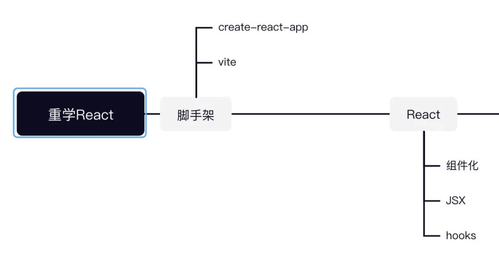
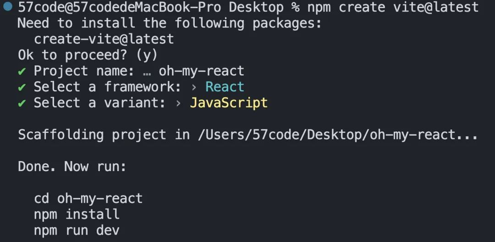
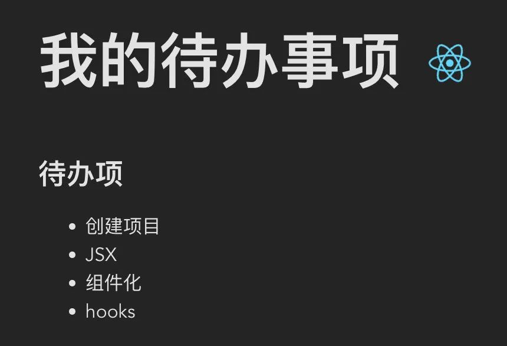
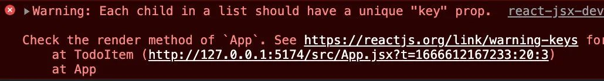
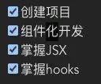
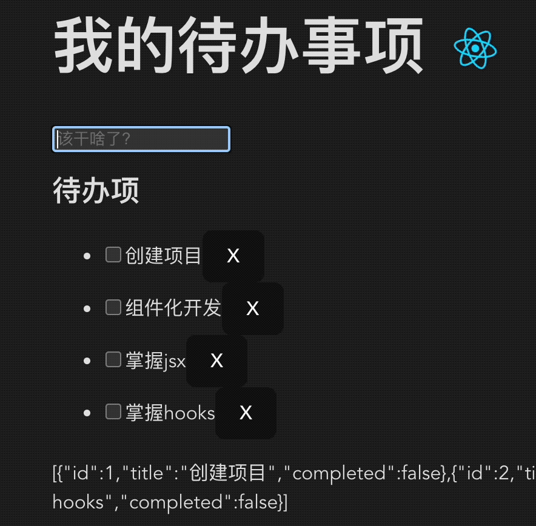
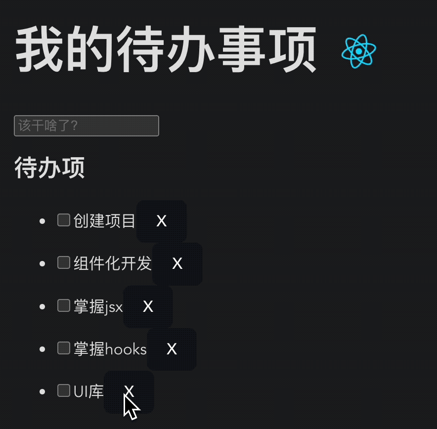
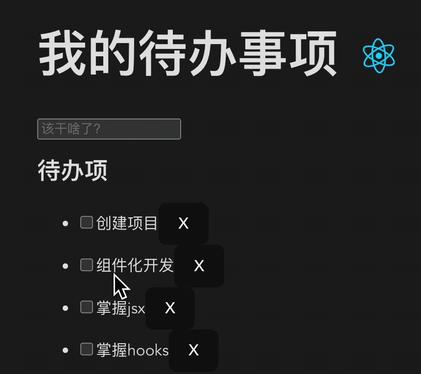
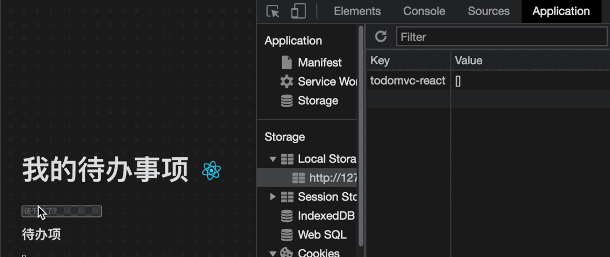
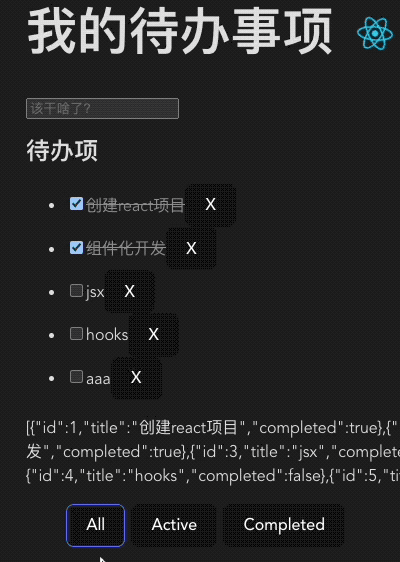

## 前言
> 由于长期工期紧，业务代码写的很冗余，没有时间迭代优化，或者时间一久就没有动力去“回炉重造”. 无意中看到[杨村长](https://juejin.cn/user/325111174926350)在
更新React整体脉络梳理，正好跟着学一下，填补一下在开发业务代码过程中的设计思想。

将涉猎到如下核心知识点：

* 如何创建一个React项目
* 如何掌握组件开发思想
* 如何玩转JSX语法糖
* 如何用好React hooks
* ...

[代码直通车](https://github.com/xizijian/todolist),善解人意的我已经整理好了，不谢(*^▽^*) 

## 搭建项目

官方推荐的SPA应用创建工具链是**create-react-app**，我个人比较青睐vite，借此也可以多踩踩坑：



用 VSCode 打开这个项目，再回到命令行中执行启动命令：

``` 
cd oh-my-react
code .
npm install
npm run dev
```


## 编写应用基本结构
调整页面结构，将src/App.js 替换为以下代码：

``` jsx
import reactLogo from "./assets/react.svg";
import "./App.css";

function App() {
  return (
    <div className="App">
      <header>
        <h1>我的待办事项</h1>
        
      </header>
      <main>
        <section>
          <h2>待办项</h2>
          <ul className="todo-list">
            <li className="todo">创建项目</li>
            <li className="todo">JSX</li>
            <li className="todo">组件化</li>
            <li className="todo">hooks</li>
          </ul>
        </section>
      </main>
    </div>
  );
}

export default App;
```

稍微修改一下样式，效果如下：


## 循环输出项目

现在我们数据是写死的，最终我们需要一个数组保存所有todo，就像下面这样：
```jsx
const todos = ['创建项目', '组件化开发', 'JSX语法糖', '掌握hooks']
```
我们需要循环输出它们，React中我们只需要对数组进行**map**转换即可：
```jsx
{/* 使用map将数据转换为JSX */}
{todos.map((todo) => (
  <li className="todo" key={todo}>
    {/* 属性是动态值使用{xxx} */}
    {/* 渲染列表时务必指定key */}
    {todo}
  </li>
))}
```
此时效果和之前是完全一样的！

请注意：渲染列表时务必添加key属性用于唯一区分列表项，否则会有警告提示信息！


## 为todo加入状态
我们的待办是有状态的，比如我们需要知道待办是否完成，因此需要像下面这样修改数据结构：
```jsx
const todos = [
  { id: 1, title: "创建项目", completed: true },
  { id: 2, title: "组件化开发", completed: false },
  { id: 3, title: "掌握JSX", completed: false },
  { id: 4, title: "掌握hooks", completed: false },
];
```
相应的，li中绑定要做相应调整
```jsx
<li className="todo" key={todo.id.toString()}>
  {todo.title}
</li>
```
## 受控组件

**todo**的完成状态需要反映在视图中，我们可以用一个checkbox的勾选状态来表示。

这就需要引入一个react的概念：受控组件，即使用react中的state作为表单输入元素唯一数据源，同时还控制用户输入过程中表单发生的操作。我们修改视图如下：
```jsx
<li className="todo" key={todo.title}>
  {/* todo.completed作为checkbox输入源 */}
  {/* 同时控制用户输入操作 */}
  <input
    className="toggle"
    type="checkbox"
    checked={todo.completed}
    onChange={(e) => changeState(e, todo)}
    />
  <span>{todo.title}</span>
</li>
```

既然**todo.computed**要求是**react**状态，我们就要使用useState将前面的todos声明为一个组件状态：
```jsx
// 将前面的`todos`创建为一个状态
const [todos, setTodos] = useState([
  { id: 1, title: "创建项目", completed: true },
  { id: 2, title: "组件化开发", completed: false },
  { id: 3, title: "掌握JSX", completed: false },
  { id: 4, title: "掌握hooks", completed: false },
]);
// 控制用户输入过程中表单发生的操作
const changeState = (e, currentTodo) => {
  currentTodo.completed = e.target.checked;
  // 必须重新设置状态，否则组件不会重新渲染
  // 更新数组需要全新对象，否则组件不会重新渲染
  setTodos([...todos]) 
};
```

效果如下：


## 新增待办
再加一个新增代码的功能。


这同样是**受控组件**的应用，我们添加一个输入框：
```jsx
<div>
  <input
    className="new-todo"
    autoFocus
    autoComplete="off"
    placeholder="该学啥了?"
    value={newTodo}
    onChange={changeNewTodo}
    onKeyUp={addTodo}
    />
</div>
```

同样需要对应的状态和事件控制：

```jsx
const [newTodo, setNewTodo] = useState("");
const changeNewTodo = (e) => {
  setNewTodo(e.target.value);
};
// 用户回车且输入框有内容则添加一个新待办
const addTodo = (e) => {
  if (e.code === 'Enter' && newTodo) {
    setTodos([
      ...todos,
      {
        id: todos.length + 1,
        title: newTodo,
        completed: false,
      },
    ]);
    setNewTodo("");
  }
};
```

## 删除待办

增加一个删除待办功能



这是**事件处理**和**状态修改**的应用，新增一个删除按钮：

```jsx
<button className="destroy" onClick={() => removeTodo(todo)}>X</button>
```

修改状态，移除数组项时过滤掉删除项，将返回的新数组指定为给todos：

```jsx
const removeTodo = (todo) => {
  setTodos(todos.filter((item) => item.id !== todo.id));
};
```

## 修改待办
我们还想设计一个行内修改待办的交互，效果如下：



这是一个动态样式、受控组件的综合应用，来看一下react中如何做。

首先修改一下视图结构：

```jsx
<div class="view">
  {/* 双击开启行内编辑：隐藏.view，显示.edit */}
  <span onDoubleClick={() => editTodo(todo)}>{todo.title}</span>
  <button className="destroy" onClick={() => removeTodo(todo)}>
    x
  </button>
</div>
{/* 声明editedTodo状态, onChange处理状态变化 */}
{/* onKeyUp处理修改确认，onBlur退出编辑模式 */}
<input
  className="edit"
  type="text"
  value={editedTodo.title}
  onChange={onEditing}
  onKeyUp={onEdited}
  onBlur={cancelEdit}
  />
```

然后给li加一个动态样式：

``` jsx
{/* editedTodo.title不为空且id和上下文中todo.id相同添加.editing */}
<li
  className={[
    "todo",
    todo.completed ? "completed" : "",
    editedTodo.title && editedTodo.id === todo.id
    ? "editing"
    : "",
  ].join(" ")}
  key={todo.id.toString()}
  >
```

添加相关样式：
```css
.todo-list li.completed span {
 color: #949494;
 text-decoration: line-through;
}
.todo-list li .edit {
 display: none;
}
.todo-list li.editing .edit {
 display: block;
 padding: 12px 16px;
}
.todo-list li.editing .view {
 display: none;
}
```

实现相关逻辑：

```jsx
const initial = {
  title: "",
  completed: false,
};
const [editedTodo, setEditedTodo] = useState(initial);

// 用户双击触发编辑模式
const editTodo = (todo) => {
  // 克隆一个todo用于编辑
  // setBeforeEditCache(todo.title);
  setEditedTodo({ ...todo });
};
// 受控组件要求的事件处理
const onEditing = (e) => {
  const title = e.target.value;
  if (title) {
    setEditedTodo({ ...editedTodo, title: e.target.value });
  } else {
    // title为空删除该项
    removeTodo(editedTodo);
  }
};
const onEdited = (e) => {
  // 监听enter
  if (e.code === "Enter") {
    if (editedTodo.title) {
      // 获取对应待办并更新
      const todo = todos.find((todo) => todo.id === editedTodo.id);
      todo.title = editedTodo.title;
      setTodos([...todos]);
    }
    setEditedTodo(initial);
  }
};
const cancelEdit = (e) => {
  setEditedTodo(initial);
};
```

## 添加副作用

进入编辑模式之后，我们希望可以自动获取焦点。

分析一下发现，设置焦点的条件是：**editedTodo**被设置为一个具体的**todo**时。那么也就是说，在**editedTodo**这个状态改变后产生了一个自动获取输入框焦点的副作用。

react提供了声明副作用方法**useEffect(effect, deps)**专门完成此类任务，表示deps中的依赖状态若发生变化则执行effect函数。

此处正好用于实现这个需求：

```jsx
useEffect(() => {
  // 如果editedTodo存在则设置焦点
  if(editedTodo.id) {}
}, [editedTodo])
```

但是此处有两个问题：如何设置**input**的焦点？设置哪个input的焦点？

这实际上是另一个知识点，react中如何获取dom元素的引用，从而可以操作dom，答案是：**ref**。

```jsx
<input
  className="edit"
  {/* 设置一个函数到ref，根据上下文中todo的情况动态设置期望的input元素 */}
  ref={e => setEditInputRef(e, todo)}
  />
```

**setEditInputRef**中根据todo和editedTodo即可判断是否是我们想要的input元素：

```jsx
let inputRef = null
const setEditInputRef = (e, todo) => {
  if (editedTodo.id === todo.id) {
    inputRef = e
  }
}
```

现在可以在副作用中执行设置焦点操作了！

```jsx
useEffect(() => {
  // 如果id存在说明切换到了编辑模式
  if (editedTodo.id) {
    inputRef.focus()
  }
}, [editedTodo])
```

## 状态持久化

还有个问题，页面刷新之后我们待办状态就失效了。很容易想到把待办列表存入**localStorage**，初始化时取出，列表有更新时保存。有没有发现，这又是一个典型的副作用使用场景。

我们实现一个**todoStorage**负责存取：

```jsx
const STORAGE_KEY = 'todomvc-react'
const todoStorage = {
  fetch () {
    const todos = JSON.parse(localStorage.getItem(STORAGE_KEY) || '[]')
    return todos
  },
  save (todos) {
    localStorage.setItem(STORAGE_KEY, JSON.stringify(todos))
  }
}
```

逻辑实现如下：

```jsx
const [todos, setTodos] = useState(todoStorage.fetch());
useEffect(() => {
  todoStorage.save(todos)
}, [todos])
```

效果如下：




## 提取组件

我们的代码量现在已经相当庞大，在它变得难以维护之前我们最好提前做重构。这里可以将app拆分为若干组件，这能够有效分割代码，提高复用性和可维护性。

这里我们将前面**div.todo-list**部分提取为可复用的**TodoList**组件，**src/TodoList.jsx：**

```jsx
import { useState, useEffect } from "react";

// 传入todos和setTodos
const TodoList = ({ todos, setTodos }) => {
  const changeState = (e, currentTodo) => {};
  const removeTodo = (todo) => {};

  const initial = {};
  const [editedTodo, setEditedTodo] = useState(initial);
  const editTodo = (todo) => {};
  const onEditing = (e) => {};
  const onEdited = (e) => {};
  const cancelEdit = (e) => {};

  let inputRef = null;
  const setEditInputRef = (e, todo) => {};
  useEffect(() => {}, [editedTodo]);

  return (
    <ul className="todo-list">
      {todos.map((todo) => (
        //...
      ))}
    </ul>
  );
};

export default TodoList;
```

相对应的，App中使用做一些修改：

```jsx
<TodoList todos={todos} setTodos={setTodos}></TodoList>
```

此时效果和之前是完全一样的！

此时**TodoList**还是有些臃肿的，我们还可以继续将列表项拆分，比如提取**TodoItem**，从而进一步拆分代码出去。如果你感兴趣可以自己试试！

## 自定义hooks (重要)

前面提取的**TodoList**中实际上只包含更新和删除操作，新增操作被留在App.jsx中，这看起来有些奇怪。分析发现，todos和其操作是通用逻辑，如果提取出来不仅可以保存状态，且能传递给多个组件使用。比如我们可以提取AddTodo组件，它就会关心新增逻辑；我们又可以提供过滤逻辑，提供给**TodoFilter**用于筛选不同状态的待办出来。

像上面这种需求就是react中的**自定义hooks**功能的应用。

我们提取一个hook：**useTodos**，具体实现如下：

```jsx
// 接收初始数据，将其声明为状态，同时提供状态操作方法给外界使用
function useTodos(data) {
  const [todos, setTodos] = useState(data);
  const addTodo = (title) => {
    setTodos([
      ...todos,
      {
        id: todos.length + 1,
        title,
        completed: false,
      },
    ]);
  }
  const removeTodo = (id) => {
    setTodos(todos.filter((todo) => todo.id !== id));
  }
  const updateTodo = (editedTodo) => {
    const todo = todos.find((todo) => todo.id === editedTodo.id);
    Object.assign(todo, editedTodo)
    setTodos([...todos]);
  }
  return {todos, addTodo, removeTodo, updateTodo}
}
```

现在我们调整App.jsx中使用方式：

```jsx
// 获取todos状态和操作方法
const {todos, addTodo, removeTodo, updateTodo} = useTodos(todoStorage.fetch())

// 原先新增的部分略微调整：
// 1.addTodo改为onAddTodo
// 2.调用addTodo实现新增
const [newTodo, setNewTodo] = useState("");
const changeNewTodo = (e) => {
  setNewTodo(e.target.value);
};
const onAddTodo = (e) => {
  if (e.code === "Enter" && newTodo) {
    addTodo(newTodo)
    setNewTodo("");
  }
};
```

对应的，TodoList实现和使用也有略微变化

```jsx
<TodoList {...{todos: filteredTodos, removeTodo, updateTodo}}></TodoList>
```

```jsx
// 接收数据和操作函数
const TodoList = ({ todos, removeTodo, updateTodo }) => {
  // 调用updateTodo更新
  const changeState = (e, currentTodo) => {
    currentTodo.completed = e.target.checked;
    updateTodo(currentTodo)
  };
  
  // ...
  
  const onEditing = (e) => {
    const title = e.target.value;
    if (title) {
      setEditedTodo({ ...editedTodo, title });
    } else {
      // 调用removeTodo执行删除
      removeTodo(editedTodo.id);
    }
  };
  const onEdited = (e) => {
    if (e.code === "Enter") {
      if (editedTodo.title) {
        // 调用updateTodo执行更新
        updateTodo(editedTodo)
      }
      setEditedTodo(initial);
    }
  };

  //...

  return (
    <ul className="todo-list">...</ul>
  );
};
export default TodoList;
```

## 过滤功能

下面我们按组件化思想继续完成最后一个需求：按状态过滤待办。



我们创建一个组件，**TodoFilter.tsx：**

我们希望外界传入过滤字段**visibility**，同时还有一个修改它的**setVisibility**。前者被修改之后，我们希望能对todos执行一个过滤操作获得**filteredTodos**，从而让**TodoList**可以根据它去显示。

```jsx
export default function TodoFilter({visibility, setVisibility}) {
  return (
    <div className="footer">
      <ul className="filters">
        <li>
          <button
            className={visibility === "all" ? "selected" : ""}
            onClick={() => setVisibility("all")}
          >
            All
          </button>
        </li>
        <li>
          <button
            className={visibility === "active" ? "selected" : ""}
            onClick={() => setVisibility("active")}
          >
            Active
          </button>
        </li>
        <li>
          <button
            className={visibility === "completed" ? "selected" : ""}
            onClick={() => setVisibility("completed")}
          >
            Completed
          </button>
        </li>
      </ul>
    </div>
  );
}
```

再在App.jsx中实现一个**useFilter**的hooks：根据**visibility**的值做不同程度的过滤。

这里是react中内置钩子**useMemo**的应用：如果todos或者**visibility**变化，我们将重新计算**filteredTodos**

```jsx
function useFilter(todos) {
  const [visibility, setVisibility] = useState("all");
  // 如果todos或者`visibility`变化，我们将重新计算`filteredTodos`
  const filteredTodos = useMemo(() => {
    if (visibility === "all") {
      return todos;
    } else if (visibility === "active") {
      return todos.filter((todo) => todo.completed === false);
    } else {
      return todos.filter((todo) => todo.completed === true);
    }
  }, [todos, visibility]);
  return {visibility, setVisibility, filteredTodos}
}
```

再看看如何使用：

```jsx
const {visibility, setVisibility, filteredTodos} = useFilter(todos)
```
```jsx
<TodoFilter visibility={visibility} setVisibility={setVisibility}></TodoFilter>
```

补充一些样式

```css
button.selected {
  border-color: #646cff;
}

.filters {
  list-style: none;
  display: flex;
}

.filters li {
  margin-right: 6px;
}
```

## 后续更新计划
终于写完了！掌握了好多react知识，但应用还有很多不完善的地方，比如：

* 我们是否可以将状态提取到全局，从而让组件获取状态，以及执行方法的时候更加简洁优雅
* 我们的样式并没有做到组件隔离，这样很容易产生污染和冲突
* 我们能否做一些权限限制，使得只有管理员才能创建和删除待办
* 等等...
这些功能会在后面逐步实现，顺便再学一下状态管理、路由这些功能库的使用。

原文链接：
[https://mp.weixin.qq.com/s/2x884JDNZvlAPfa0Eq9uMw](https://mp.weixin.qq.com/s/2x884JDNZvlAPfa0Eq9uMw)